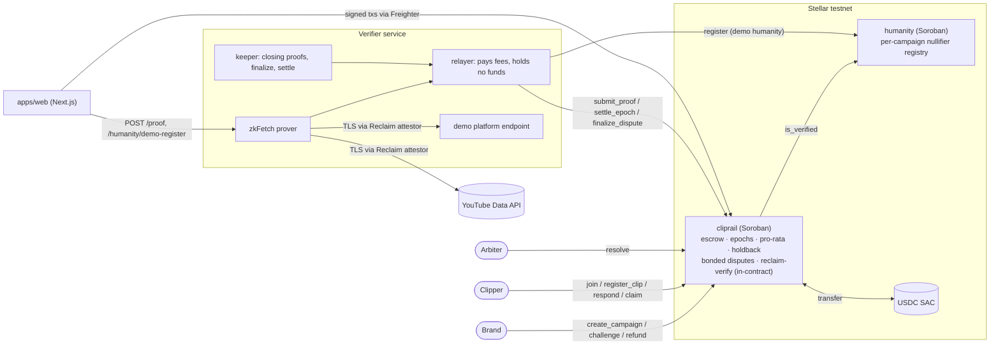

# ClipRail

**Verifiable pay-per-view clipping campaigns on Stellar.**

A brand locks a USDC budget in a Soroban escrow with rules that cannot change after launch. Clippers who are registered in a per-campaign humanity registry post campaign clips on their own social accounts, tagged with a personal campaign code. View counts are proven with zkTLS (Reclaim), and the proof is checked **inside the contract**: the attestor signature, the exact API URL, the extraction regexes, and the clipper's code in the video description. Each epoch the budget is split pro-rata over proven view growth, under a per-1k rate ceiling and per-human caps. Payout transactions cost well under a cent on testnet (measured below), so there is no minimum payout, and clippers in any country can be paid.

> **The number is real** (zkTLS, verified on-chain) · **One human, once** (per-campaign nullifier) · **The rules can't change** (Soroban escrow)

**Full lifecycle on testnet: 39/39 steps, explorer links → [docs/e2e-testnet-run.md](docs/e2e-testnet-run.md)**

What is and is not proven today:

- **In-contract proof verification** is tested against Reclaim's reference vector (`contracts/reclaim-verify`) and in a full testnet lifecycle run (create → join → clips → proofs → dispute → settle → claim → holdback → refund) using Reclaim-format proofs signed by a **simulated attestor** ([docs/e2e-testnet-run.md](docs/e2e-testnet-run.md)).
- **Live Reclaim zkFetch run:** pending credentials. **[TBD: link to live-proof testnet run]**
- **Humanity** is a per-campaign nullifier registry. In the demo, registration goes through a relayer; a Self ZK passport proof is on the roadmap.

Status: hackathon build on Stellar **testnet**. Demo video: **[TBD: demo video link]**

## Judge quickstart

```bash
(cd contracts && cargo test)                                 # cliprail, humanity, reclaim-verify
pnpm install && pnpm -r test                                 # verifier, @cliprail/shared, @cliprail/client
pnpm --filter e2e deploy -- --redeploy                       # fresh e2e instance on testnet (simulated attestor)
pnpm --filter e2e run                                        # full lifecycle, rewrites docs/e2e-testnet-run.md
pnpm --filter e2e seed -- --mode local                       # demo seed; --mode real requires Reclaim credentials
```

The e2e scripts need funded testnet accounts from `bash scripts/setup-accounts.sh`. A fresh instance is needed per run because the video registry is global.

---

## Three trust layers

| Layer | Guarantee | How |
|---|---|---|
| **The number is real** | The view count and description the platform served reach the contract unmodified | Reclaim zkTLS proof. Secp256k1 attestor signature, URL template, `responseMatches` and extracted `views`/`desc` are all verified in the `cliprail` contract (`contracts/reclaim-verify`), not by a backend |
| **One human, once** | A registered nullifier joins a campaign at most once, and caps apply per nullifier, not per account | `humanity` registry: `(campaign, nullifier)` and `(campaign, wallet)` are each unique. The nullifier is scoped per campaign. Demo: relayer registration; roadmap: Self ZK passport proof |
| **The rules can't change** | Rate, caps, windows, holdback, bond and arbiter are fixed at creation. There are no discretionary rejections | Budget sits in a Soroban escrow. Every payout is a formula over proven numbers. Disputes are bonded and time-boxed |

## The problem

Clipping is now a real market: brands and creators pay "clippers" per view to repost short cuts of their content. Whop Content Rewards has been reported to pay out on the order of tens of thousands of dollars per day (Forbes, April 2026, as cited by third-party guides). The market runs on trust it has not earned:

- **Discretionary payouts.** Platforms count views their own way and reject submissions "at our sole discretion". Clippers report long payout delays and agency cuts on top of platform fees.
- **Bot fraud.** Bot views are cheap. The StreamAlive founder described (blog post, September 2025) paying for a clipping campaign whose views turned out to be mostly bots. Nobody can prove what was counted.
- **Payout rails exclude the workforce.** Many clippers are in India, the Philippines and Latin America, where PayPal is unavailable or impractical.

Competitors advertise "verified views" but cannot show the verification. ClipRail makes it checkable: the count comes from a proof, the payout from immutable code.

## How it works

```
create ─▶ humanity ─▶ join (CR code) ─▶ register clip (opening proof = baseline)
      ─▶ [ epoch e: closing proof ─▶ bonded dispute ─▶ settle (pro-rata, rate ceiling) ─▶ claim ] × E
      ─▶ holdback released by next-epoch liveness ─▶ refund
```

1. **Create.** The brand calls `create_campaign` and the budget moves into escrow. Parameters are validated (`epoch_len ≥ proof + dispute + arbiter windows`, `claim_grace ≥ epoch_len`, `bond > 0`, arbiter ≠ brand) and are then immutable.
2. **Humanity.** The clipper is registered in `humanity` with a per-campaign nullifier. A second wallet with the same nullifier is rejected.
3. **Join.** `join` checks `humanity.is_verified` and returns a code `CR-XXXXXX` derived from `sha256(campaign_id ‖ participant)`. The clipper puts it in the video description.
4. **Register clip.** The clipper submits the video link. The verifier produces an **opening proof**: the description contains the code, and the current views are N. The contract verifies it and records `baseline = N`, so only growth after registration counts. Each `(platform, video_id)` can be registered only once, globally.
5. **Closing proofs.** In every epoch's window `[content_end, proof_end)` anyone can submit a fresh proof. If the same clip is re-proven in the window, the higher view count wins. The verifier's keeper does this automatically.
6. **Bonded disputes.** Anyone can challenge a clip-epoch by posting a bond. The clipper responds for free. The arbiter rules on responded disputes only. An unanswered challenge excludes the clip. An arbiter who misses the deadline loses by default: the clipper wins. Excluded weight is redistributed to other clippers through the rate. It does not return to the brand.
7. **Settle.** After `settle_at(e)`, with no open disputes, `settle_epoch` fixes the epoch rate (see below). Unspent budget carries over to the next epoch.
8. **Claim.** `claim` pays each clip-epoch its share, O(1). Part of it (`holdback_bps`) is held back.
9. **Holdback.** Epoch e's held share is released only to clips that are still live, meaning they got a closing proof in epoch e+1. Deleted videos forfeit their share to the survivors. The last epoch has no holdback.
10. **Refund.** After `refund_at = settle_at(last) + claim_grace`, the remaining campaign balance returns to the brand.

## Architecture



The verifier has **no authority over funds**. It cannot change a count because the attestor signs it, and it cannot pay anyone. The worst it can do is not submit a proof, and anyone else can submit one in the same window.

## Mechanism

Per epoch `e`, for clip `c` of participant `p`:

```
w_c   = min(max(views_c − baseline_c, 0), cap_views_clip) ;  w_c < min_views ⇒ 0
raw_p = Σ w_c                         (participant's clips this epoch)
w_p   = min(raw_p, cap_views_human)   (per-human cap)
W_e   = Σ w_p

B_e      = budget/E (+ remainder in last epoch) + carry_e
r_eff    = W_e == 0 ? 0 : min(r_max, 1000 · B_e / W_e)      (USDC per 1k views)
spent_e  = r_eff · W_e / 1000 ;   carry_{e+1} = B_e − spent_e

pay_c    = r_eff · w_p · w_c / (raw_p · 1000)
held_c   = pay_c · holdback_bps / 10000   (0 in the last epoch) ;  immediate_c = pay_c − held_c
```

- **High-water mark baseline.** A clip-epoch's baseline is pinned to the clip's `hwm` (the highest proven views so far) at the first closing proof. Views that drop and rise again are never paid twice.
- **No race.** With few views, clippers earn `r_max`. When demand exceeds the budget, the rate falls and everyone shares proportionally. `Σ payouts ≤ budget` always holds.
- **Holdback survivors share:**
  `held_total_e = spent_e · bps / 10000`, `held_survived_e = Σ held_i` over clips proven alive in e+1, and `holdback_claim_i = held_i · held_total_e / held_survived_e`.
- **Accounting invariant.** Every campaign has its own `balance` ledger, and every outflow is clamped to it. The contract's token balance equals `Σ campaign.balance + open bonds`.

## Security model

| Trusted party | What it could do | Mitigation |
|---|---|---|
| Reclaim attestor (single key today) | Sign a false count | Attestor allowlist in contract. Reclaim runs it in a TEE. Multi-attestor on the roadmap |
| Platform (YouTube) | Count bot views | Per-clip and per-human caps, `min_views`, bonded disputes, pro-rata dilution |
| Humanity relayer (demo) | Register fake nullifiers | Registry logic is final. The relayer is swapped for on-chain ZK identity verification (roadmap) |
| Brand | Challenge in bad faith | Bond goes to the clipper if the challenge fails. Excluded weight never returns to the brand |
| Arbiter | Rule with bias | Only rules on disputes the clipper answered. Missing the deadline means the clipper wins |
| Verifier / relayer | Withhold a proof (censor a clip) | Cannot touch funds or counts. Anyone can submit in the window, and the higher count wins |
| Admin | Change attestors, owners, platform config | Campaign rules are immutable. Production would use a timelock and multisig |

### Honest limits

- **zkTLS proves the count the platform displays, not that viewers are human.** We mitigate bot views with caps, disputes and pro-rata dilution. We do not claim to solve them.
- **One Reclaim attestor key.** The address we allowlist (`0x2448…9072`, from Reclaim's reference vector) is to be confirmed with a live proof. Trust moves from "our server" to "a third-party, signed, TEE-backed attestor". That is better, but not trustless.
- **Humanity is a demo registration via relayer** (`/humanity/demo-register`). The contract-side per-campaign nullifier logic is complete. Self passport ZK is on the roadmap. Identities can be rented, which raises the Sybil cost to the price of a real identity without eliminating it.
- **The live demo uses a platform endpoint we control** (`/demo/videos/:id`) so viewers can watch the count grow within minutes. Once Reclaim credentials are in place it is a **real zkTLS proof** verified in-contract; until then the testnet run uses a simulated attestor. The YouTube path uses the same verifier.
- The proof `timestampS` is chosen by the prover, so freshness relies on the allowlisted `owner` (our zkFetch app).

## Threat → mitigation

Every row has a dedicated test in [`contracts/cliprail/src/test/attacks.rs`](contracts/cliprail/src/test/attacks.rs) that asserts the exact error.

| # | Attack | Mitigation | Test |
|---|---|---|---|
| A1 | Replay the same proof | Replay set keyed by `keccak(identifier ‖ timestampS)` | `a01_proof_reuse` |
| A2 | Register one video in two campaigns (or `id=a,b` tricks) | Global `(platform, video_id)` registry and video-id charset check | `a02_video_twice` |
| A3 | Add a code to an already viral video | Baseline from the opening proof | `a03_code_added_to_viral_video` |
| A4 | Proof for another URL or video | URL template equality on root `url` | `a04_proof_for_other_video` |
| A5 | Proof with a different regex (e.g. likes) | Required `responseMatches` checked | `a05_other_regex` |
| A6 | Code missing, or someone else's code | Code search inside extracted `desc` only | `a06_code_missing_or_foreign` |
| A7 | Stale or future timestamp | Freshness and window checks | `a07_stale_or_future_timestamp` |
| A8 | Unauthorized attestor, owner, or tampered payload | Recovered-address allowlist and owner allowlist | `a08_unknown_attestor_or_owner` |
| A9 | Sybil: same person, second wallet | Per-campaign nullifier in `humanity` | `a09_sybil_second_wallet` |
| A10 | Many clips to exceed caps | Per-clip cap and per-human cap | `a10_caps_many_clips` |
| A11 | Budget exhaustion | Pro-rata rate and balance clamp | `a11_budget_exhaustion` |
| A12 | Views drop then rise again | High-water mark | `a12_views_drop_then_rise` |
| A13 | Double claim | `claimed` flag | `a13_double_claim` |
| A14 | Claim while disputed | Settle blocked by open disputes, and claim blocked by status | `a14_claim_while_disputed` |
| A15 | Non-arbiter resolves | `arbiter.require_auth()` | `a15_non_arbiter_resolve` |
| A16 | Early refund | `refund_at` | `a16_early_refund` |
| A17 | Video deleted after payout | No next-epoch proof, so its holdback goes to survivors | `a17_deleted_video_forfeits_holdback` |

## Testnet deployment

| Contract | ID |
|---|---|
| `cliprail` | [`CCICEPQCY25RNF5SAJ3FPUXPXEIRQ3GOUMSVZGVCHRJ6L6Q3FHJL3TST`](https://stellar.expert/explorer/testnet/contract/CCICEPQCY25RNF5SAJ3FPUXPXEIRQ3GOUMSVZGVCHRJ6L6Q3FHJL3TST) |
| `humanity` | [`CAUU4KCBSL3L5CCLU2S5GNZ354S4X3DP6Z5ZSWMSDDCNNNE3AJSCGKMQ`](https://stellar.expert/explorer/testnet/contract/CAUU4KCBSL3L5CCLU2S5GNZ354S4X3DP6Z5ZSWMSDDCNNNE3AJSCGKMQ) |
| USDC (test issuer, SAC) | [`CCRCO347GR4FVCZACMTXZWE4EKTICARZXRRTS4R4HZZYK7R7E65UX45E`](https://stellar.expert/explorer/testnet/contract/CCRCO347GR4FVCZACMTXZWE4EKTICARZXRRTS4R4HZZYK7R7E65UX45E) |

**e2e instance (simulated attestor)**, separate from the main deployment, used for the [lifecycle run](docs/e2e-testnet-run.md):

| Contract | ID |
|---|---|
| `cliprail` (e2e) | [`CC4SMPQWP56TUVAUAWMK4BLOONQPBLJAWDVNPE6HMZGEMG67WW4XR7T3`](https://stellar.expert/explorer/testnet/contract/CC4SMPQWP56TUVAUAWMK4BLOONQPBLJAWDVNPE6HMZGEMG67WW4XR7T3) |
| `humanity` (e2e) | [`CB24BRMGW4ZTLJVC2ETKU5URUD7PXQ6BOYEKV4JUIO7O62GZWM6ZZZUM`](https://stellar.expert/explorer/testnet/contract/CB24BRMGW4ZTLJVC2ETKU5URUD7PXQ6BOYEKV4JUIO7O62GZWM6ZZZUM) |

Network: `Test SDF Network ; September 2015`, RPC `https://soroban-testnet.stellar.org`. Test accounts are listed in [docs/INTERFACES.md §6](docs/INTERFACES.md). Verifier URL: **[TBD]**

## Repository layout

```
contracts/
  reclaim-verify/   no_std lib: identifier, EIP-191 digest, secp256k1 recover, root-level JSON scanner
  cliprail/         campaigns, global video registry, epochs, pro-rata settle, claims, holdback, disputes, refund
  humanity/         per-campaign nullifier registry (constructor: admin, relayer)
services/verifier/  Node/TS: zkFetch proofs, relay, keeper, demo platform endpoint, rate limits
packages/
  client/           @cliprail/client: chain and mock CliprailApi for the web app (tx helpers with retry, proof calls)
  cliprail-client/  generated TS bindings (stellar contract bindings typescript)
  humanity-client/  generated TS bindings
  shared/           @cliprail/shared: timeline, payout, errors, video-id parsing, formatting (mirrors the contract)
apps/web/           Next.js dApp (in progress)
config/             providers.json (URL templates + regexes per platform)
fixtures/           Reclaim reference vector, required substrings
scripts/            setup-accounts.sh, deploy.sh, bindings.sh
  e2e/              testnet lifecycle run (deploy.ts, run.ts), simulated attestor (proofgen.ts), demo seeding (seed-demo.ts)
docs/               ARCHITECTURE, INTERFACES, e2e-testnet-run, DEMO, reclaim-notes, DEVELOPMENT_PLAN, HANDOFF
```

## Running it

**Prerequisites:** Rust stable with `wasm32v1-none`, `stellar-cli` v28, Node 24, pnpm.

```bash
rustup default stable && rustup target add wasm32v1-none
brew install stellar-cli
pnpm install
```

**Contracts: test and build**

```bash
cd contracts && cargo test && stellar contract build
```

**Testnet: accounts, deploy, bindings**

```bash
bash scripts/setup-accounts.sh          # funds admin/relayer/arbiter/brand/clippers, issues test USDC + SAC (idempotent)
RECLAIM_APP_ID=0x… DEMO_PUBLIC_BASE=https://verifier.example.com \
  bash scripts/deploy.sh                # deploys humanity + cliprail (constructors) and sets attestors/owners/platforms
bash scripts/bindings.sh                # regenerates packages/cliprail-client and packages/humanity-client
```

`deploy.sh` reuses the IDs in `scripts/.accounts/deploy.env` and only replays the config calls. Use `FORCE_DEPLOY=1` to deploy fresh contracts.

**Verifier service**

```bash
cp services/verifier/.env.example services/verifier/.env   # RECLAIM_APP_ID/SECRET, YT_API_KEY, DEMO_PUBLIC_BASE, ...
pnpm --filter verifier dev                                 # http://localhost:8787
```

- Without Reclaim credentials the service still starts. `/health` and `/demo/*` work, and `/proof` returns 503.
- `RELAYER_SECRET`, `CLIPRAIL_ID` and `HUMANITY_ID` fall back to `scripts/.accounts/`.
- `KEEPER=1` enables automatic closing proofs, dispute finalization and settlement.
- `DEMO_MODE=1` enables `/humanity/demo-register`.
- `WRITE_TOKEN` protects write endpoints, and `/proof` is rate-limited per IP.
- Docker and Caddy deployment instructions are in [services/verifier/README.md](services/verifier/README.md).

**Web:** `apps/web` is in progress.

## Tests

| Suite | Command | Result |
|---|---|---|
| `cliprail` contract (flows, disputes, A1–A17 attacks) | `cd contracts && cargo test` | 40 passed |
| `humanity` contract | ″ | 8 passed |
| `reclaim-verify` (Reclaim reference vector, k256 signatures, JSON scanner) | ″ | 24 passed |
| Verifier service | `pnpm --filter verifier test` | 50 passed |
| `@cliprail/shared` (timeline/payout parity with contract) | `pnpm --filter @cliprail/shared test` | 65 passed |
| `@cliprail/client` | `pnpm --filter @cliprail/client test` | 17 passed |
| Testnet lifecycle (simulated attestor) | `pnpm --filter e2e run` | 39/39 steps ([report](docs/e2e-testnet-run.md)) |

**204 unit and integration tests in total**, plus the 39-step testnet run. Tests never call the real zkFetch.

## Cost

Measured on testnet in the [lifecycle run](docs/e2e-testnet-run.md): average CPU instructions from simulation and the fee actually paid.

| Function | CPU instructions | Fee paid |
|---|---|---|
| `create_campaign` | ~1.45M | ~0.111 XLM |
| `join` | ~1.7M | ~0.023 XLM |
| `register_clip` (opening proof, verified in contract) | ~5.2M | ~0.061 XLM |
| `submit_proof` (closing proof, verified in contract) | ~5.3M | ~0.072 XLM |
| `challenge` | ~2.3M | ~0.059 XLM |
| `settle_epoch` | ~1.5M | ~0.0012 XLM |
| `claim` | ~2.0M | ~0.0023 XLM |

Reclaim proof verification alone costs 3.2M instructions (142 B context) to 10.2M (7.9 KB), measured on the real wasm including VM setup ([docs/reclaim-notes.md](docs/reclaim-notes.md)). Every call stays far inside Soroban's 400M-instruction per-transaction budget. The most expensive call is `create_campaign` at ~0.11 XLM; the recurring payout calls (`settle_epoch`, `claim`) cost a small fraction of a cent.

## Why Stellar

- **Native USDC and low fees.** A classic USDC payment costs ~0.00001 XLM, and the Soroban calls above cost cents or less (`claim` ~0.0023 XLM), which makes per-epoch micro-payouts with no minimum threshold possible.
- **Anchors and MoneyGram** let clippers cash out locally (SEP-24) in markets PayPal does not serve.
- **Host crypto functions** (`secp256k1_recover`, `keccak256`) make it cheap enough to verify a Reclaim zkTLS proof fully inside a Soroban contract: a full verification measures ~3–10M instructions of the 400M per-transaction budget. BN254 host functions open the way to on-chain Groth16 identity proofs.
- A layer that complements the **Stellar Disbursement Platform**: SDP distributes, ClipRail proves what should be paid.

## Roadmap

- **Self ZK identity on-chain:** verify the passport/Aadhaar Groth16 proof in Soroban with the BN254 host functions, replacing the demo relayer.
- **Device-side Reclaim** proofs for TikTok, X and Instagram, where session cookies stay private.
- **Passkey wallets and fee sponsorship:** no seed phrase and no XLM needed.
- **SEP-24 / MoneyGram cash-out** in the clipper's local currency.
- **Optimistic dispute resolution with proofs**, e.g. a "video deleted" claim settled by a zkTLS proof.
- **SDP integration** for large-scale disbursement.
- **Multi-attestor** threshold verification.

## Docs

| | |
|---|---|
| [docs/e2e-testnet-run.md](docs/e2e-testnet-run.md) | **Headline evidence:** full testnet lifecycle, 39/39 steps, explorer links, measured costs (TR) |
| [docs/DEMO.md](docs/DEMO.md) | Demo runbook: seeding, real vs. simulated-attestor mode, fallbacks (TR) |
| [docs/ARCHITECTURE.md](docs/ARCHITECTURE.md) | Design rationale, mechanism, trust model, threat table (TR) |
| [docs/INTERFACES.md](docs/INTERFACES.md) | Contract, service and web interfaces (TR) |
| [docs/reclaim-notes.md](docs/reclaim-notes.md) | Byte-level Reclaim proof format and in-contract verification (TR) |
| [docs/DEVELOPMENT_PLAN.md](docs/DEVELOPMENT_PLAN.md) · [docs/HANDOFF.md](docs/HANDOFF.md) | Internal planning docs: plan, tasks, team handoff (Turkish) |
