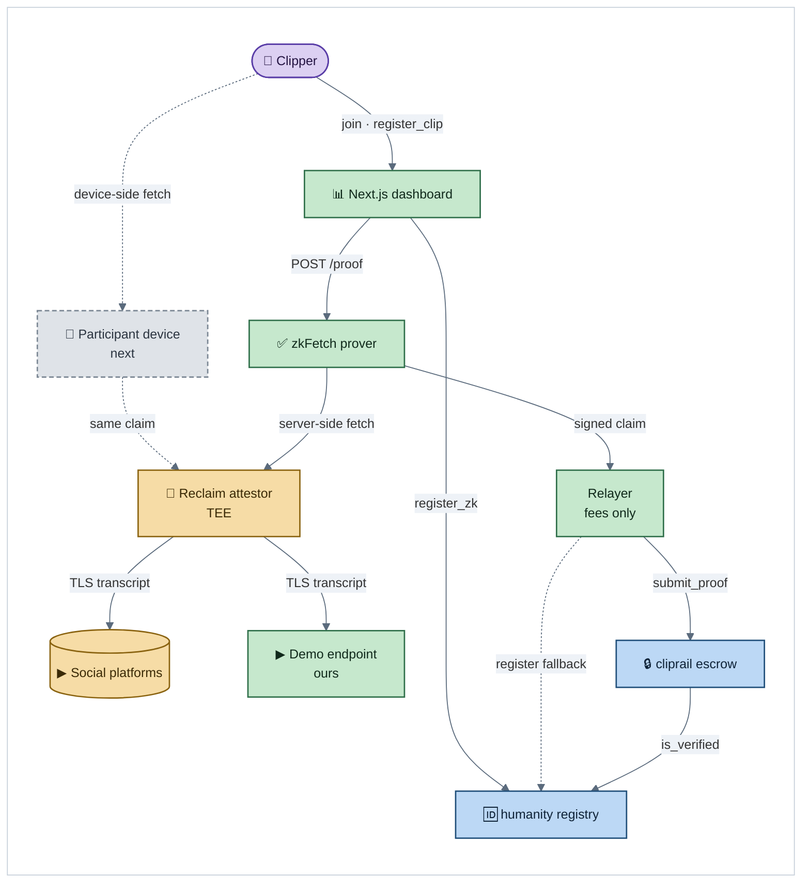
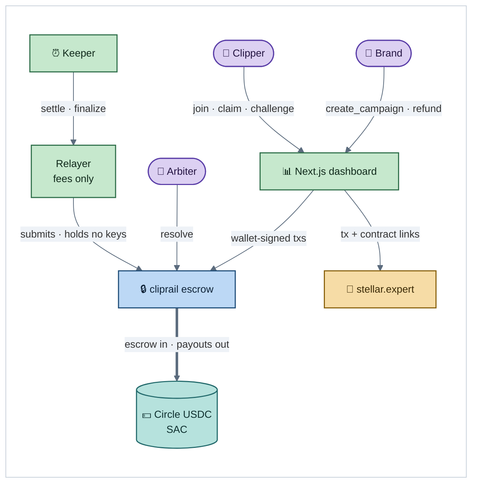
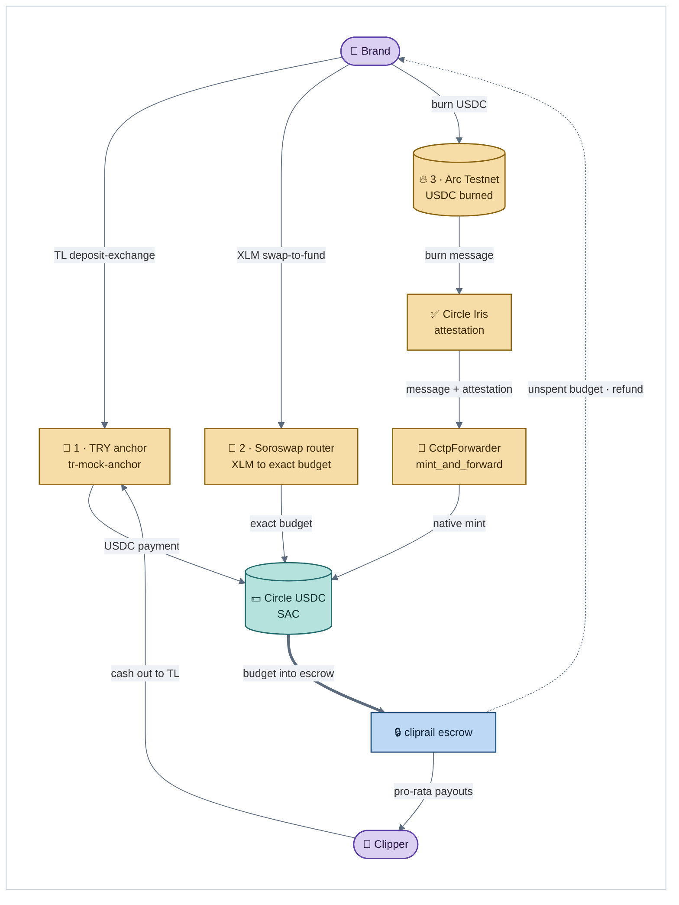
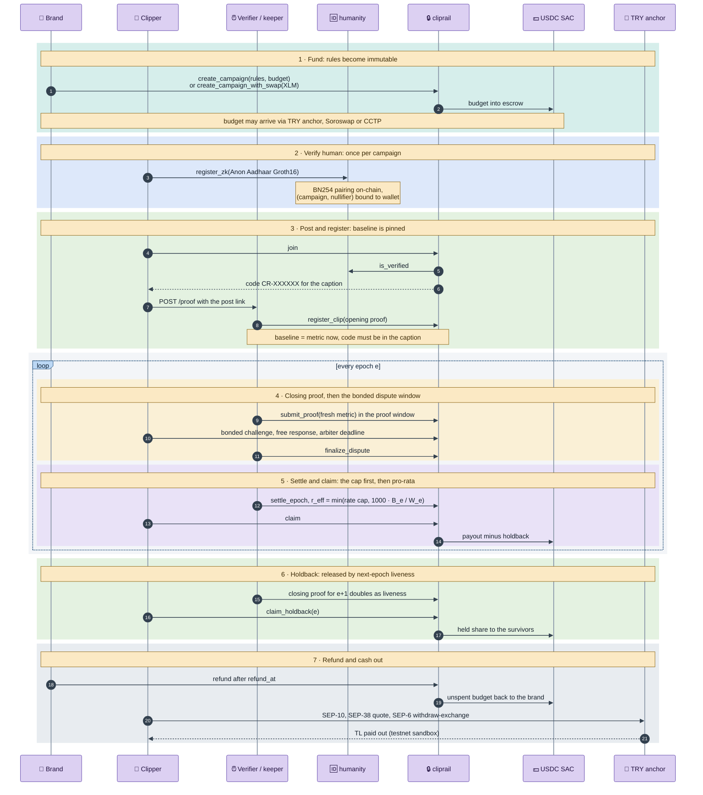

# Cashtag

**Verifiable pay-per-reach content campaigns on Stellar: any platform, any content format.**

A brand publishes a brief or an asset and locks a USDC budget in a Soroban escrow with rules that cannot change after launch. Participants who are registered in a per-campaign humanity registry publish **their own content** (a short video, an image, a thread, a plain text post) on **their own social accounts**, with a personal campaign code in the caption or description. The agreed reach metric (views, plays, likes, or whatever the campaign pays for) is proven with zkTLS (Reclaim), and the proof is checked **inside the contract**: the attestor signature, the exact URL for that platform, the extraction regexes, and the participant's code in the extracted caption text. Each epoch the budget is split over proven metric growth: the advertised per-1k rate is a **ceiling** ("up to X per 1,000"), and if the proven reach would cost more than the epoch budget at that ceiling, the epoch budget is shared pro-rata instead, under per-clip and per-human caps. Payout transactions cost well under a cent on testnet (measured below), so there is no minimum payout, and participants in any country can be paid.

The first market we go after is **clipping campaigns**, and the on-chain naming still carries that history: the contract functions are `register_clip` and `submit_proof`, and a "clip" on-chain simply means *a registered post*. Nothing in the contract is video-specific or platform-specific. See [Platforms](#platforms).

**A note on names.** The product is **Cashtag**. On-chain and package names still use the original `cliprail` identifier; it means the same thing. The Soroban crate and contract are `cliprail`, its functions are `register_clip` and `submit_proof`, the npm packages are `@cliprail/shared` and `@cliprail/client`, and participant codes are contract-generated `CR-XXXXXX`. Renaming them would mean redeploying the contract and invalidating every explorer link in this README, so the identifiers stay as they are.

> **The number is real** (zkTLS, verified on-chain) · **One human, once** (per-campaign nullifier) · **The rules can't change** (Soroban escrow)

**Full lifecycle on testnet: 39/39 steps** (`pnpm --filter e2e run e2e` reproduces it and prints every explorer link).

What is and is not proven today:

- **A live Reclaim zkTLS proof is verified on-chain.** A real zkFetch proof signed by Reclaim's production attestor (`0x2448…9072`, `attestor.reclaimprotocol.org`, epoch 1) was accepted by the `cliprail` contract on testnet: [`register_clip` with a live opening proof](https://stellar.expert/explorer/testnet/tx/dfc3b7dd5256a2b9177e4c86002b06ce0e9a33db3e8a8fdc029e59f73f593bbd) (clip 3, baseline 1200) and [`submit_proof` with a live closing proof](https://stellar.expert/explorer/testnet/tx/6729a5468ba252ada84b8805a98be51c83bd8275c110a072ee069da224340d69) (5200 views → weight 4000). The canonical `parameters` / `context` bytes matched our documented format exactly.
- **X (Twitter) is live as a platform.** `x` is registered on the demo deployment with [`set_platform("x", …)`](https://stellar.expert/explorer/testnet/tx/2707530e880bd48a5619a32d99850e040d0debc9133206d31aa3e9d5cbecadde), proofs are fetched server-side from X's public syndication endpoint (no login, no API key), and a live Reclaim proof over a **real public post** was replayed against the contract: signature, attestor and owner allowlists, URL equality, both required `responseMatches` and the metric all passed on-chain. The call stopped only at the final code-in-post check (`#17 CodeNotFound`), because that public post naturally carries no campaign code, which is the binding a real participant supplies with their `CR-XXXXXX`. Note the metric there is **likes** (`favorite_count`), not views. See [Platforms](#a-live-x-proof-replayed-on-chain).
- **In-contract proof verification** is also tested against Reclaim's reference vector (`contracts/reclaim-verify`), against saved live proofs (`fixtures/reclaim/demo-live-proof.json` and `fixtures/reclaim/x-live-proof.json`, offline regression tests in `services/verifier/test/live-proof.test.ts` and `services/verifier/test/x-live-proof.test.ts` that recompute the identifier and the EIP-191 digest and recover the live attestor address), and in a full testnet lifecycle run (create → join → posts → proofs → dispute → settle → claim → holdback → refund).
- **Humanity is verified on-chain.** `humanity.register_zk` checks an Anon Aadhaar Groth16 proof (BN254) inside Soroban, bound to the campaign (nullifier seed) and to the submitting wallet (signal hash), for ~30.8M CPU instructions (~0.034 XLM fee on testnet). The demo uses UIDAI **test** data signed with the Anon Aadhaar test key, proven server-side by the verifier; production pins the real UIDAI key and proves in the browser. A relayer `register` path remains as a fallback.
- **Funding and cash-out are live on testnet.** A brand can fund a campaign with XLM in one transaction (`create_campaign_with_swap` through the Soroswap router, tested: 47.37 XLM → 5 USDC escrow), and a clipper can cash out USDC to TRY through a SEP-6 anchor (tested: 5 USDC → 242.70 TL; 5000 TL → 101.98 USDC on the way in).
- **A brand does not need USDC on Stellar at all.** With **Circle CCTP V2**, native USDC burned on another chain is attested by Circle and minted on Stellar straight into the escrow asset: [burn of 5 USDC on Arc Testnet](https://testnet.arcscan.app/tx/0xfe502def03331ffe33d17f7496edf6f932c1966e99f030806e4e7b40e2525bea) → [`mint_and_forward` on Stellar](https://stellar.expert/explorer/testnet/tx/ea727dcc6e648f0da4722fa4d2b2b40f59bac808a79b90ed43a33b8df8293a30), 24 s, 0 bps fee, and no contract change was needed. See [Funding a campaign from another chain](#funding-a-campaign-from-another-chain-circle-cctp-v2).

Status: hackathon build on Stellar **testnet**, Rise In × Stellar hackathon, **Scale track**. Live demo: **https://cashtag-stellar-web.vercel.app** · Demo video: **[TBD: demo video link]**

### Scale track requirements

- [x] **Integrations (load-bearing): Soroswap and Circle CCTP V2**, two listed ecosystem partners, both on the path a brand's money takes into an escrow. **Soroswap = swap-to-fund:** `cliprail.create_campaign_with_swap` calls the Soroswap router from inside the contract, swaps the brand's XLM (or any asset with a pool) into exactly `budget` of Circle USDC and escrows it atomically. **CCTP = bridge-to-fund:** `scripts/cctp` burns native USDC on Arc Testnet, Circle attests it, and `CctpForwarder.mint_and_forward` mints it on Stellar as the very same Circle USDC SAC the escrow holds ([burn](https://testnet.arcscan.app/tx/0xfe502def03331ffe33d17f7496edf6f932c1966e99f030806e4e7b40e2525bea) · [mint](https://stellar.expert/explorer/testnet/tx/ea727dcc6e648f0da4722fa4d2b2b40f59bac808a79b90ed43a33b8df8293a30)). See [Stellar integrations](#stellar-integrations) and [Funding a campaign from another chain](#funding-a-campaign-from-another-chain-circle-cctp-v2).
- [x] **Anchor / local currency: TRY via SEP-6.** SEP-1 discovery, SEP-10 auth, SEP-12 KYC, SEP-38 quotes and SEP-6 `deposit-exchange` / `withdraw-exchange` against the testnet anchor `tr-mock-anchor.fly.dev` (brand funds in TL, clipper cashes out to TL).
- [x] **Core feature:** verifiable pay-per-reach escrow, platform- and content-agnostic: in-contract zkTLS proof verification (a **live Reclaim attestor-signed proof** accepted on testnet: [`register_clip`](https://stellar.expert/explorer/testnet/tx/dfc3b7dd5256a2b9177e4c86002b06ce0e9a33db3e8a8fdc029e59f73f593bbd) · [`submit_proof`](https://stellar.expert/explorer/testnet/tx/6729a5468ba252ada84b8805a98be51c83bd8275c110a072ee069da224340d69)), on-chain Anon Aadhaar humanity (`register_zk`), pro-rata settle, holdback, bonded disputes, refund. [Full product lifecycle run](#full-product-lifecycle-run-testnet) on the demo deployment.
- [x] **Architecture diagram (Mermaid):** [Architecture](#architecture).
- [x] **SCF roadmap:** [Roadmap → SCF / InstAward](#roadmap--scf--instaward).
- [x] **Stellar skills cited:** [Stellar skills used](#stellar-skills-used).

**Jump to:** [How to evaluate](#how-to-evaluate) · [Platforms](#platforms) · [Architecture](#architecture) · [Stellar integrations](#stellar-integrations) · [Stellar skills used](#stellar-skills-used) · [Design decisions & trade-offs](#design-decisions--trade-offs) · [Challenges](#challenges) · [Honest limits](#honest-limits) · [Roadmap → SCF / InstAward](#roadmap--scf--instaward)

## How to evaluate

| What | Where |
|---|---|
| Live dashboard (Next.js) | **https://cashtag-stellar-web.vercel.app** |
| Verifier service (`/health`, `/demo/videos/:id`) | **https://cashtag-stellar.loca.lt** |
| Contracts | [Demo deployment (testnet)](#demo-deployment-testnet), each linked to stellar.expert |
| Live Reclaim zkTLS proof verified on-chain | [`register_clip`](https://stellar.expert/explorer/testnet/tx/dfc3b7dd5256a2b9177e4c86002b06ce0e9a33db3e8a8fdc029e59f73f593bbd) · [`submit_proof`](https://stellar.expert/explorer/testnet/tx/6729a5468ba252ada84b8805a98be51c83bd8275c110a072ee069da224340d69), replayed offline by `pnpm --filter verifier test` |
| X (Twitter) live on-chain | [`set_platform("x", …)`](https://stellar.expert/explorer/testnet/tx/2707530e880bd48a5619a32d99850e040d0debc9133206d31aa3e9d5cbecadde) · [campaign 9 with `platforms: ["x"]`](https://stellar.expert/explorer/testnet/tx/a53eaa67fefae5e01fd0212823640fbc8dc01b5d0fec207660cbdbdbc31bc148) · [join → `CR-7ZYWBA`](https://stellar.expert/explorer/testnet/tx/5f0fc0c5815846e3fb5714143f5c34d4c069270d65ae378c7a3163dad62c81f8), and [a live X proof replayed against every contract check](#a-live-x-proof-replayed-on-chain) |
| Full lifecycle, reproducible | `pnpm --filter e2e run e2e`: 39/39 steps, prints every explorer link |
| Product lifecycle (Soroswap funding → ZK humanity → payouts → TRY cash-out) | `REFUND=1 pnpm --filter @cliprail/client smoke:full`, see [the run](#full-product-lifecycle-run-testnet) |
| Cross-chain funding (Circle CCTP V2) | [Arc Testnet burn](https://testnet.arcscan.app/tx/0xfe502def03331ffe33d17f7496edf6f932c1966e99f030806e4e7b40e2525bea) → [Stellar `mint_and_forward`](https://stellar.expert/explorer/testnet/tx/ea727dcc6e648f0da4722fa4d2b2b40f59bac808a79b90ed43a33b8df8293a30), reproducible with `pnpm --filter cctp bridge -- --amount 5 --chain arc --fast`, see [the section](#funding-a-campaign-from-another-chain-circle-cctp-v2) |

**Test wallets.** Use any wallet supported by Stellar Wallets Kit (e.g. Freighter switched to *Testnet*) and fund it with Friendbot. Campaign budgets use **Circle testnet USDC** (`USDC:GBBD47…LFLA5`, add a trustline). A brand without USDC can fund a campaign with XLM through Soroswap, buy USDC with TL through the TRY anchor, or bridge USDC in from another chain with Circle CCTP V2. No mainnet funds are involved.

**Five-minute check:**

```bash
(cd contracts && cargo test)                                 # cliprail, humanity (incl. Groth16), reclaim-verify
pnpm install && pnpm -r test                                 # verifier, @cliprail/shared, @cliprail/client
pnpm --filter e2e run deploy -- --redeploy                       # fresh e2e instance on testnet (simulated attestor)
pnpm --filter e2e run e2e                                    # full lifecycle on testnet, prints explorer links
pnpm --filter e2e run seed -- --mode local                       # demo seed; --mode real requires Reclaim credentials
```

A fresh e2e instance is needed per run because the post registry (`(platform, post id)`) is global. Code worth reading: `contracts/reclaim-verify/src/lib.rs` (in-contract zkTLS), `contracts/humanity/src/groth16.rs` (BN254 Groth16), `contracts/cliprail/src/test/attacks.rs` (A1-A17).

---

## Three trust layers

| Layer | Guarantee | How |
|---|---|---|
| **The number is real** | The reach metric and the caption text the platform served reach the contract unmodified | Reclaim zkTLS proof. Secp256k1 attestor signature, URL template, `responseMatches` and the extracted metric / caption fields (`views`/`desc`) are all verified in the `cliprail` contract (`contracts/reclaim-verify`), not by a backend |
| **One human, once** | A registered nullifier joins a campaign at most once, and caps apply per nullifier, not per account | `humanity` registry: `(campaign, nullifier)` and `(campaign, wallet)` are each unique. The nullifier is scoped per campaign and the proof is bound to the wallet. Anon Aadhaar Groth16 verified on-chain (`register_zk`); relayer `register` as fallback |
| **The rules can't change** | Rate, caps, windows, holdback, bond and arbiter are fixed at creation. There are no discretionary rejections | Budget sits in a Soroban escrow. Every payout is a formula over proven numbers. Disputes are bonded and time-boxed |

## The problem

Clipping is now a real market: brands and creators pay "clippers" per view to repost short cuts of their content. Whop Content Rewards has been reported to pay out on the order of tens of thousands of dollars per day (Forbes, April 2026, as cited by third-party guides). The market runs on trust it has not earned:

- **Discretionary payouts.** Platforms count views their own way and reject submissions "at our sole discretion". Clippers report long payout delays and agency cuts on top of platform fees.
- **Bot fraud.** Bot views are cheap. The StreamAlive founder described (blog post, September 2025) paying for a clipping campaign whose views turned out to be mostly bots. Nobody can prove what was counted.
- **Payout rails exclude the workforce.** Many clippers are in India, the Philippines and Latin America, where PayPal is unavailable or impractical.

Competitors advertise "verified views" but cannot show the verification. Cashtag makes it checkable: the number comes from a proof, the payout from immutable code. Clipping is the first market, not the boundary: the same escrow pays any content campaign on any platform, because all the protocol needs is a configured URL template and a metric to extract.

## How it works

```
create ─▶ humanity ─▶ join (CR code) ─▶ register post (opening proof = baseline)
      ─▶ [ epoch e: closing proof ─▶ bonded dispute ─▶ settle (pro-rata, rate ceiling) ─▶ claim ] × E
      ─▶ holdback released by next-epoch liveness ─▶ refund
```

1. **Create.** The brand calls `create_campaign` and the budget moves into escrow. Parameters are validated (`epoch_len ≥ proof + dispute + arbiter windows`, `claim_grace ≥ epoch_len`, `bond > 0`, arbiter ≠ brand) and are then immutable.
2. **Humanity.** The clipper submits an Anon Aadhaar Groth16 proof to `humanity.register_zk`. The contract recomputes the bound public inputs itself (UIDAI pubkey hash from config, `nullifierSeed = keccak256("cliprail:" ‖ campaign_id) >> 3`, `signalHash = keccak256(wallet ed25519 key) >> 3`), checks the QR timestamp against `max_age`, and runs the BN254 pairing check. A second wallet with the same nullifier is rejected.
3. **Join.** `join` checks `humanity.is_verified` and returns a code `CR-XXXXXX` derived from `sha256(campaign_id ‖ participant)`. The participant puts it in the caption or description of the post.
4. **Register the post.** The participant submits the post link. The verifier produces an **opening proof**: the extracted caption contains the code, and the current metric value is N. The contract verifies it and records `baseline = N`, so only growth after registration counts. Each `(platform, post id)` pair can be registered only once, globally. (The on-chain function is `register_clip`, and the registry key is `(platform, video_id)`, historical naming for "a registered post".)
5. **Closing proofs.** In every epoch's window `[content_end, proof_end)` anyone can submit a fresh proof. If the same post is re-proven in the window, the higher metric value wins. The verifier's keeper does this automatically.
6. **Bonded disputes.** Anyone can challenge a post-epoch by posting a bond. The clipper responds for free. The arbiter rules on responded disputes only. An unanswered challenge excludes the post. An arbiter who misses the deadline loses by default: the clipper wins. Excluded weight is redistributed to other clippers through the rate. It does not return to the brand.
7. **Settle.** After `settle_at(e)`, with no open disputes, `settle_epoch` fixes the epoch rate at `min(rate cap, 1000 × epoch budget / total eligible weight)`. The advertised rate is an upper bound, and a busy epoch pays its budget out pro-rata instead ([details](#the-rate-is-a-ceiling-not-a-price)). Unspent budget carries over to the next epoch and ends up back with the brand at `refund`.
8. **Claim.** `claim` pays each post-epoch its share, O(1). Part of it (`holdback_bps`) is held back.
9. **Holdback.** Epoch e's held share is released only to posts that are still live, meaning they got a closing proof in epoch e+1. Deleted posts forfeit their share to the survivors. The last epoch has no holdback.
10. **Refund.** After `refund_at = settle_at(last) + claim_grace`, the remaining campaign balance returns to the brand.

### Funding a campaign from another chain (Circle CCTP V2)

Step 1 assumes the brand holds USDC on Stellar. It does not have to. `scripts/cctp/` takes USDC that lives on another chain and moves it with [Circle CCTP V2](https://developers.circle.com/cctp), which burns at the source, takes a Circle attestation and does a **native mint** on Stellar (no wrapped asset, no bridge liquidity pool), and then opens the campaign with it:

```
Arc Testnet USDC ──burn──▶ Circle attestation ──mint──▶ Stellar USDC ──escrow──▶ campaign #N
  (domain 26)                    (Iris)                 (domain 27)             (cliprail)
```

**Arc Testnet** (Circle's own L1, CCTP domain 26) is the default source chain, with **Base Sepolia** (domain 6) as a fallback. Stellar is domain 27, through `TokenMessengerMinter` [`CDNG7HXA…RTHP`](https://stellar.expert/explorer/testnet/contract/CDNG7HXAPBWICI2E3AUBP3YZWZELJLYSB6F5CC7WLDTLTHVM74SLRTHP), `MessageTransmitter` [`CBJ6MTCK…VVJY`](https://stellar.expert/explorer/testnet/contract/CBJ6MTCKKZG73PMDZCJMSFRD7DQEMI4FKDH7CGDSV4W6FHCRBCQAVVJY) and the `CctpForwarder` [`CA66Q2WF…4VSZ`](https://stellar.expert/explorer/testnet/contract/CA66Q2WFBND6V4UEB7RD4SAXSVIWMD6RA4X3U32ELVFGXV5PJK4T4VSZ). **No contract change was needed:** `create_campaign` escrows any SAC token, and what CCTP mints is exactly the Circle testnet USDC SAC the escrow already uses ([`CBIELTK6…DAMA`](https://stellar.expert/explorer/testnet/contract/CBIELTK6YBZJU5UP2WWQEUCYKLPU6AUNZ2BQ4WWFEIE3USCIHMXQDAMA)).

**The byte layout that protects the funds.** A `G…` account can never be a CCTP `mintRecipient`: CCTP address fields are raw 32 bytes with no type marker, so the protocol assumes the recipient is a contract. Both `mintRecipient` and `destinationCaller` are therefore the `CctpForwarder`, and the real recipient travels inside `hookData`: 24 zero bytes, then a big-endian `uint32` hook version, a big-endian `uint32` length, then the recipient strkey as UTF-8. `CctpForwarder.mint_and_forward(message, attestation)` mints and pays the recipient in one atomic invocation. One wrong byte strands the transfer permanently, so **20 unit tests pin that layout** (`pnpm --filter cctp test`), and `bridge.ts` re-parses its own hook data and aborts *before* burning if the round-trip does not come back identical.

**Measured on testnet.**

| Run | Result | Transactions |
|---|---|---|
| Bridge 5 USDC, Arc → Stellar, Fast finality | **24 s** burn → mint (attestation 10-13 s), **0 bps fee** | [Arc burn](https://testnet.arcscan.app/tx/0xfe502def03331ffe33d17f7496edf6f932c1966e99f030806e4e7b40e2525bea) · [Stellar `mint_and_forward`](https://stellar.expert/explorer/testnet/tx/ea727dcc6e648f0da4722fa4d2b2b40f59bac808a79b90ed43a33b8df8293a30) |
| Bridge 1 USDC (smoke run) | **25 s** burn → mint | [Arc burn](https://testnet.arcscan.app/tx/0xb2c06a426c48db549b9cfeafa2d84fd148461bbd214dd1b223fa89415fbbe0ec) · [Stellar mint](https://stellar.expert/explorer/testnet/tx/2d85b781d319ba84c41b9d54b3dfcca9836d4154ffb02498d983131e1e894c48) |
| `create_campaign` with the bridged USDC | **7 s**, so **~31 s end to end** from burn to a funded campaign | **[campaign #10](https://stellar.expert/explorer/testnet/tx/401924c7e6d7c7e5bada57499387fa20d8a41cd16abde0f3b848b4cc3fce2451)** (on the [demo deployment](#demo-deployment-testnet)) |

Across the two runs **6 USDC were burned and exactly 6 USDC were minted**: CCTP charged **0 bps** on Arc → Stellar at both the Standard and the Fast finality tier. Total gas for all four Arc transactions came to **0.008985 USDC** (Arc pays gas in USDC, so a single faucet claim covers the whole demo). The 6-decimal → 7-decimal conversion was exact: `1000000` → `10000000` and `5000000` → `50000000`, never through a float.

**Commands.**

```bash
pnpm --filter cctp keygen                                   # one-off: demo EVM account (key stays gitignored, mode 600)
pnpm --filter cctp dry-run                                  # no funds move: RPC, contract specs, fees, encoding, balances
pnpm --filter cctp bridge -- --amount 5 --chain arc --fast  # approve → burn → attestation → mint_and_forward → verify balance
pnpm --filter cctp fund-campaign -- --budget 5              # create_campaign with the bridged USDC
```

If the Stellar mint fails after a successful burn, nothing is lost: the attestation stays valid and `bridge` prints the `--resume <0x…>` command that finishes the transfer. Details are in [`scripts/cctp/README.md`](scripts/cctp/README.md).

**Honest note: this is testnet.** The source chain is Arc Testnet, the attestations come from Circle's **sandbox** Iris service, and the USDC is claimed from `faucet.circle.com`, so no real money moves. Mainnet is the same code path with different domain ids and contract addresses.

## Platforms

The contract is **platform-agnostic and content-agnostic**. It stores a `platform` symbol and a post id, and for every proof it checks three things and nothing else:

1. the proof's root `url` equals the configured template for that platform with the registered post id in it,
2. the extracted caption/description field contains the participant's campaign code,
3. the reach metric is the number extracted by that platform's configured regex from the attestor-signed response.

Whether the post is a short video, an image, a thread or a plain text update never reaches the protocol. Neither does the content itself: the contract sees a signed response, a URL, a code and a number.

| Platform | How the proof is fetched | Metric | Status |
|---|---|---|---|
| `demo` (`/demo/videos/:id` on our own verifier) | Server-side: public endpoint, no login | `viewCount` (**views**) | **Configured**. Used for the live demo, so the number can move while you watch |
| `youtube` (YouTube Data API v3) | Server-side: public, login-free JSON endpoint (API key sent in a redacted header) | `viewCount` (**views**) | **Configured**. Chosen first *only* because it exposes an endpoint a server-side prover can read |
| `x` (X/Twitter, `cdn.syndication.twimg.com/tweet-result`) | Server-side: public syndication endpoint, no login, no API key | `favorite_count` gives **likes** (`"metric": "likes"`), so a campaign on `x` pays per like, not per view | **Live**. Registered on the demo deployment with [`set_platform("x", …)`](https://stellar.expert/explorer/testnet/tx/2707530e880bd48a5619a32d99850e040d0debc9133206d31aa3e9d5cbecadde); a live Reclaim proof of a real public post passed every on-chain check ([below](#a-live-x-proof-replayed-on-chain)) |
| X impressions/views, TikTok, Instagram | Device-side: the participant's own Reclaim app / browser extension fetches from their logged-in session | plays / views / impressions, whichever the provider entry extracts | **Next**: production path, see below |

**Adding a platform is a config change, not a contract change.** One entry in `config/providers.json` (a URL template plus the two regexes that extract the metric and the caption) and one `set_platform` admin call. That is the whole integration; `cliprail` is not redeployed and not modified. **X was added exactly this way and is live**: one entry plus [`set_platform("x", …)`](https://stellar.expert/explorer/testnet/tx/2707530e880bd48a5619a32d99850e040d0debc9133206d31aa3e9d5cbecadde) on the demo deployment. The entry:

```json
"x": {
  "metric": "likes",
  "urlPrefix": "https://cdn.syndication.twimg.com/tweet-result?lang=en&token=a&id=",
  "urlSuffix": "",
  "responseMatches": [
    { "type": "regex", "value": "\"favorite_count\":\\s*(?<views>\\d+)" },
    { "type": "regex", "value": "\"id_str\":\"\\d+\",\"text\":\"(?<desc>(?:[^\"\\\\]|\\\\.)*)\"" }
  ]
}
```

The source is X's **public syndication endpoint**, the same one X's own embed widget calls when a post is embedded on a web page. It needs no login and no API key; the `token` parameter is not validated by the endpoint, which is why a constant token (`token=a`) works and the post id can be the URL suffix the contract checks, exactly as `register_clip` requires.

The two capture groups are named `views` and `desc` because those are the contract's fixed extraction keys: `views` is "the number this platform pays on" and `desc` is "the text that must contain the campaign code". The `metric` field says what the number actually is.

**On `x` that number is likes, not views, and we never call it views.** The syndication endpoint carries `favorite_count` and no impression count, so a campaign on `x` pays **per like**. The capture group is still spelled `views` only because that is the contract's fixed key name; `"metric": "likes"` is what the dashboard and the campaign brief show. This has a direct pricing consequence: **`r_max` for an `x` campaign must be set on a different scale than for a views-based campaign.** Likes run roughly 0.1-1% of impressions, so a rate copied from a views campaign would overpay by two to three orders of magnitude. The rate is a ceiling, "up to X USDC per 1k of *this platform's* metric", and on `x` that is 1k likes.

The `desc` regex is deliberately anchored on `"id_str":"…","text":"` rather than on a bare `"text":"`. X serializes hashtag objects earlier in the payload, and each of them has its own `text` key, so a naive `"text":"(?<desc>…)"` match would extract a hashtag instead of the post body, and the campaign code would never be found. Anchoring on the preceding `id_str` field pins the match to the post's own text. The same bytes are pinned on-chain as required `responseMatches`, so a proof produced with a looser regex is rejected.

`fixtures/required-substrings.json` is regenerated from `config/providers.json`, and `scripts/deploy.sh` feeds those exact byte strings to `set_platform(platform, url_prefix, url_suffix, required)`. From then on the contract enforces URL equality and the presence of exactly those `responseMatches` for every proof under that platform.

**The metric is part of the provider config, not of the contract.** A campaign can pay per views, per plays, per likes, or per another agreed metric. The rate `r_max` is simply the ceiling "up to X USDC per 1k of that metric", and an epoch whose reach exceeds the budget shares that budget [pro-rata](#the-rate-is-a-ceiling-not-a-price). Because the required `responseMatches` are pinned per platform, a proof produced with a *different* regex is rejected: a likes regex cannot be passed off as a views regex (attack [A5](#threat--mitigation)).

### A live X proof, replayed on-chain

A live Reclaim zkFetch proof was produced over the syndication response of a **real public X post** and replayed against the contract's checks on the demo deployment. Everything the contract verifies passed:

- the attestor's secp256k1 signature, recovered in-contract;
- the recovered address against the **live attestor allowlist**;
- the proof `owner` against the owner allowlist;
- root `url` equality, `url == urlPrefix ‖ post id ‖ urlSuffix` for the registered post id;
- **both** required `responseMatches`, byte-for-byte, against the pinned `set_platform` strings;
- the metric parsed out of `extractedParameters` (`favorite_count` → likes).

The call stopped at exactly one step: the final "the participant's code is inside the post text" check, error **#17 `CodeNotFound`**, because the proof was taken over a well-known public post, which naturally does not contain a Cashtag campaign code. In other words: **every verification step passed; only the campaign-code binding was absent**, and a real participant satisfies it by putting their `CR-XXXXXX` code in the post. That last check is not a platform integration concern; it is the same code-in-caption check that `demo` and `youtube` already pass on testnet.

The campaign side is live too: campaign **id 9** on the demo deployment was created with `platforms: ["x"]` ([tx](https://stellar.expert/explorer/testnet/tx/a53eaa67fefae5e01fd0212823640fbc8dc01b5d0fec207660cbdbdbc31bc148)), and `clipper1` joined it and received the code **`CR-7ZYWBA`** ([tx](https://stellar.expert/explorer/testnet/tx/5f0fc0c5815846e3fb5714143f5c34d4c069270d65ae378c7a3163dad62c81f8)) to place in the post.

The proof is saved at `fixtures/reclaim/x-live-proof.json` and replayed offline by `services/verifier/test/x-live-proof.test.ts`, which recomputes the identifier and the EIP-191 digest, recovers the live attestor address and asserts both required substrings, so the X path stays a regression test that never touches the live Reclaim quota.

**Why TikTok, Instagram and X's view counts take the device-side flow.** Their pages do not reliably serve those numbers to a datacenter IP without a login: the response depends on a logged-in session, which a server-side prover does not have. X's public syndication endpoint is the exception that proves the point: it is readable without a session, but it carries `favorite_count` and not the impression count, which is why `x` pays on likes today. Views on X are only reachable through a guest-token GraphQL endpoint whose query hash rotates with X's web bundle and may be bound to the requesting IP. We deliberately did **not** ship that, because pinning bytes on-chain against an endpoint that changes with every frontend deploy would break proofs on X's release schedule. Reclaim's device-side flow solves this at the fetch layer: the participant's own Reclaim mobile app or browser extension makes the request from their already-logged-in session, the session cookies stay private through the ZK redaction, and the attestor signs **the same claim shape** the contract already verifies. Neither the contract nor the proof pipeline changes; only *who runs the fetch* does. That is why the login-free platforms came first and why the device-side flow is the production path to the platforms and metrics clippers actually work with, not a workaround.

## Architecture

**Who proves what.** A clipper posts, a fetch is attested, the contract verifies the signature itself.



**Legend.** Blue: on-chain Soroban contracts · green: off-chain services we run (they hold no funds) · amber: external / third-party · purple: people and wallets. **Dashed = not live yet** (the device-side proof path) or fallback-only (the humanity relayer); everything drawn solid runs on testnet today.

The clipper signs `join` and `register_clip` from the Next.js dashboard (`apps/web`) with the Stellar Wallets Kit; the dashboard calls the **zkFetch prover** (`POST /proof`, `/humanity/*`), which runs in live Reclaim mode and falls back to a simulated mode for rehearsals. The **Reclaim attestor** runs in a TEE and signs the URL, the metric and the caption over the TLS transcript of the fetch. The server-side fetch covers the login-free sources: our demo endpoint `/demo/videos/:id`, plus `youtube` and `x` (X on likes); TikTok, Instagram and X's view counts need the **device-side path** (the participant's own Reclaim app or browser extension, fetching from their already logged-in session), which is drawn dashed because it is next, not live. It changes only *who performs the fetch*, while the attestor, the claim shape and the in-contract verification stay identical. Signed claims reach `cliprail` as `register_clip` and `submit_proof` through the relayer, which pays fees only. Personhood is separate: `register_zk` verifies an Anon Aadhaar **Groth16 proof over BN254** inside the `humanity` registry and binds one per-campaign nullifier to the wallet (the relayer is a fallback caller for it), and `cliprail` asks `is_verified` before it lets a wallet join.

**Who can move money.** Every value-moving call is signed by the person it belongs to; our services can only pay fees.



**Legend.** Same colours, plus teal for the escrow asset. Nothing here is dashed: every edge already runs on testnet.

`cliprail` is the escrow: epochs, pro-rata settlement, the holdback, bonded disputes and the zkTLS verification done in-contract. Brand and clipper sign `create_campaign`, `join`, `register_clip`, `claim`, `claim_holdback`, `challenge` and `refund` themselves in the dashboard with the Stellar Wallets Kit, and the dashboard links every one of them to `stellar.expert`. The **keeper** drives the schedule: it asks the prover for closing proofs and hands `settle_epoch` and `finalize_dispute` to the **relayer**, which pays transaction fees and holds no authority over funds. The **arbiter** can only `resolve` a bonded dispute. The only asset that ever moves is the **Circle USDC SAC**: budget in at `create_campaign`, payouts out at `claim` and `claim_holdback`.

**Funding routes.** Three ways money gets into a campaign, all ending in the same Circle USDC SAC the escrow holds, so `cliprail` never learns which one was used.



**Legend.** The numbered routes: **1 ·** TRY anchor (SEP-6), **2 ·** Soroswap swap-to-fund, **3 ·** Circle CCTP V2 bridge-to-fund. Same colours: blue: on-chain Soroban contracts · amber: external / third-party rails (anchor, Soroswap, Circle) · purple: people and wallets · teal: the escrow asset. All three routes have run on testnet; the one dashed edge is the brand refund, which opens only after `refund_at`.

The brand may hold TL, XLM or USDC on another chain, and needs no USDC on Stellar to start. **Route 1** is the testnet anchor `tr-mock-anchor.fly.dev`: SEP-1 discovery, SEP-10 auth, SEP-12 KYC, SEP-38 quotes and SEP-6 `deposit-exchange` turn TL into USDC, and the same anchor runs `withdraw-exchange` the other way when a clipper cashes out. **Route 2** is `create_campaign_with_swap`, which calls the Soroswap router's `swap_tokens_for_exact_tokens` from inside the contract, so the brand's XLM becomes exactly `budget` in USDC and is escrowed atomically. **Route 3** is `scripts/cctp`: `depositForBurnWithHook` burns native USDC on Arc Testnet (CCTP domain 26), Circle Iris attests it in 10 to 13 s at 0 bps, and `CctpForwarder.mint_and_forward` mints it on Stellar (domain 27) to the recipient carried in `hookData`, with no wrapped asset anywhere. All three land in the Circle USDC SAC, the only asset the escrow ever sees: `create_campaign` moves the budget in, `cliprail` keeps a balance per campaign, and clippers are paid pro-rata through `claim` and `claim_holdback`.

### Campaign lifecycle



**Legend.** Each coloured band is one lifecycle phase, numbered 1-7; the step numbers on the arrows are the order of the calls. Everything in bands 1-7 has run on testnet (see [the lifecycle run](#full-product-lifecycle-run-testnet)); the TL leg of band 7 is a testnet sandbox anchor.

The verifier has **no authority over funds**. It cannot change a count because the attestor signs it, and it cannot pay anyone. The worst it can do is not submit a proof, and anyone else can submit one in the same window.

## Mechanism

Per epoch `e`, for registered post `c` (a `clip` on-chain) of participant `p`. The parameter names say `views` because that is the contract's fixed extraction key and the metric of `demo` and `youtube`; on `x` the same slot carries **likes**. The formulas apply to whatever metric the platform's provider entry extracts:

```
w_c   = min(max(views_c − baseline_c, 0), cap_views_clip) ;  w_c < min_views ⇒ 0
raw_p = Σ w_c                         (participant's posts this epoch)
w_p   = min(raw_p, cap_views_human)   (per-human cap)
W_e   = Σ w_p

B_e      = budget/E (+ remainder in last epoch) + carry_e
r_eff    = W_e == 0 ? 0 : min(r_max, 1000 · B_e / W_e)      (USDC per 1k; r_max is a ceiling)
spent_e  = r_eff · W_e / 1000 ;   carry_{e+1} = B_e − spent_e

pay_c    = r_eff · w_p · w_c / (raw_p · 1000)
held_c   = pay_c · holdback_bps / 10000   (0 in the last epoch) ;  immediate_c = pay_c − held_c
```

- **High-water mark baseline.** A post-epoch's baseline is pinned to the post's `hwm` (the highest proven metric value so far) at the first closing proof. A number that drops and rises again is never paid twice.
- **No race.** While proven reach is low, everyone is paid at the ceiling `r_max`. When the epoch's eligible weight would cost more than `B_e` at that ceiling, the rate falls and the epoch budget is shared pro-rata instead. `Σ payouts ≤ budget` always holds, so nobody can drain the budget and the brand never pays above the ceiling. See [The rate is a ceiling, not a price](#the-rate-is-a-ceiling-not-a-price).
- **Holdback survivors share:**
  `held_total_e = spent_e · bps / 10000`, `held_survived_e = Σ held_i` over posts proven alive in e+1, and `holdback_claim_i = held_i · held_total_e / held_survived_e`.
- **Accounting invariant.** Every campaign has its own `balance` ledger, and every outflow is clamped to it. The contract's token balance equals `Σ campaign.balance + open bonds`.

### The rate is a ceiling, not a price

`rate_max_per_1k` (`r_max`) is the **most** a campaign will ever pay per 1,000 of the metric, not a promise of a fixed price per 1k. What is actually fixed is the epoch budget `B_e = budget/E + carry_e`, and the effective rate is

```
r_eff = min(r_max, 1000 · B_e / W_e)        W_e = total eligible weight in epoch e
```

Under-subscribed epoch: everyone is paid at the ceiling and the unspent remainder carries into the next epoch, ending up back with the brand at `refund`; it is never shared out. Over-subscribed epoch: `r_eff` drops below the ceiling and the epoch budget is split pro-rata by each participant's eligible weight, after the per-clip (`cap_views_clip`) and per-human (`cap_views_human`) caps have been applied. So no one can drain the budget, and the brand can never overpay above the ceiling.

**Worked example**, with the real numbers from the [lifecycle run](#full-product-lifecycle-run-testnet): budget 5 USDC over 2 epochs (`B_e` = 2.5 USDC), ceiling `r_max` = 1 USDC per 1k.

| Epoch | Eligible weight `W_e` | `1000 · B_e / W_e` | `r_eff` | Spent | Left over |
|---|---|---|---|---|---|
| e0 (over-subscribed) | 6,000 (4,000 + 2,000) | 0.4166666 USDC/1k | **0.4166666** (pro-rata) | 2.4999996 USDC | ~0, carried |
| e1 (under-subscribed) | 1,500 (1,000 + 500) | 1.6666669 USDC/1k | **1.0000000** (the ceiling) | 1.5 USDC | 1.0 USDC → refunded |

In e0 the two clippers had proven 4,000 and 2,000 of weight and were paid 1.3333331 and 0.6666665 USDC: the epoch budget shared 2:1, not 4 and 2 USDC at the advertised rate. In e1 the ceiling bound instead, 1,500 of weight cost only 1.5 USDC, and the 1.0 USDC the epoch did not spend went back to the brand at `refund` (1.0000006 USDC including rounding dust).

**Pool-share mode is roadmap, not implemented.** A pure pool-share campaign (no ceiling at all, the epoch budget always divided by proven weight) would be one extra campaign parameter next to `r_max`; today every campaign runs with the ceiling.

## Security model

| Trusted party | What it could do | Mitigation |
|---|---|---|
| Reclaim attestor (single key today) | Sign a false count | Attestor allowlist in contract. Reclaim runs it in a TEE. Multi-attestor on the roadmap |
| The platform itself (whichever is configured) | Serve an inflated metric (bot views) | Per-post and per-human caps, `min_views`, bonded disputes, pro-rata dilution |
| Humanity relayer (fallback path) | Register fake nullifiers | The primary path `register_zk` needs no relayer: the Groth16 proof is verified on-chain and bound to the wallet. The relayer role is admin-set (`set_relayer`) and can be retired in production |
| Admin (UIDAI key config) | Accept proofs under a wrong key | `pubkey_hash` is pinned in `AadhaarConfig`. The demo uses the Anon Aadhaar test key (`test_key: true`); production pins the real UIDAI key |
| Brand | Challenge in bad faith | Bond goes to the clipper if the challenge fails. Excluded weight never returns to the brand |
| Arbiter | Rule with bias | Only rules on disputes the clipper answered. Missing the deadline means the clipper wins |
| Verifier / relayer | Withhold a proof (censor a post) | Cannot touch funds or numbers. Anyone can submit in the window, and the higher value wins |
| Admin | Change attestors, owners, platform config | Campaign rules are immutable. Production would use a timelock and multisig |

### Honest limits

- **zkTLS proves the number the platform serves, not that the audience is human.** We mitigate bot-inflated metrics with caps, disputes and pro-rata dilution. We do not claim to solve them.
- **Only platforms with a login-free endpoint can be proven server-side today.** `demo`, `youtube` and `x` are live because a datacenter prover can read those endpoints without a session, and on `x` that endpoint exposes likes, not impressions. TikTok, Instagram and X view counts need Reclaim's device-side flow (participant's app or extension, logged-in session, cookies redacted). The contract already accepts those proofs (the claim shape is identical), but the device-side client is not shipped yet, so those platforms are not configured.
- **X support rides on an undocumented embed endpoint.** `cdn.syndication.twimg.com/tweet-result` is the endpoint X's own embed widget calls; it is not a documented API, and X can change, rate-limit or block it at any time. This is a **best-effort integration, and it fails closed**: if the response shape changes, the pinned `responseMatches` bytes no longer match and the proof is *rejected* on-chain. A broken endpoint means proofs stop being accepted; it never means a wrong number is silently accepted.
- **Long X posts truncate `text`.** For posts past the short-form limit the syndication payload moves the full body into `note_tweet` and leaves a truncated `text`, which is the field the `desc` regex reads. The campaign code should therefore appear **early in the post**, within the truncated part. The campaign brief says so, and a code that falls outside it simply fails the code check (error #17) rather than paying out incorrectly.
- **One Reclaim attestor key.** The live address we allowlist (`0x244897572368eadf65bfbc5aec98d8e5443a9072`, `attestor.reclaimprotocol.org`) is confirmed by a [live on-chain proof](https://stellar.expert/explorer/testnet/tx/6729a5468ba252ada84b8805a98be51c83bd8275c110a072ee069da224340d69), but it is still a single key. Trust moves from "our server" to "a third-party, signed, TEE-backed attestor". That is better, but not trustless. Multi-attestor threshold verification is on the roadmap.
- **Humanity uses UIDAI test data in the demo.** `register_zk` verifies a real Anon Aadhaar Groth16 proof on-chain, but the demo proof is generated by the verifier (`/humanity/aadhaar/prove`) from the official UIDAI test QR under the Anon Aadhaar **test** key. Production proves in the user's browser from their own Aadhaar QR and pins the real UIDAI key. Aadhaar covers India only until more identity sources are added. Identities can be rented, which raises the Sybil cost to the price of a real identity without eliminating it.
- **The TRY anchor is a testnet sandbox** (`tr-mock-anchor.fly.dev`): the SEP-6/10/12/38 flow is real, but the bank leg (TL in and out) is simulated and no real money moves. A licensed Turkish anchor is needed for production.
- **The live demo uses a platform endpoint we control** (`/demo/videos/:id`) so viewers can watch the count grow within minutes. The proof over it is a **real zkTLS proof** signed by Reclaim's attestor and verified in-contract, but the number it attests comes from an endpoint we host, so counts can move during a live demo. The `youtube` platform uses the same verifier, the same proof format and the same in-contract checks; only the provider entry differs.
- **Two attestor modes.** The verifier runs in `reclaim` mode (live attestor) or `simulated` mode (a clearly labeled local test key); the latter is for rehearsals, so the free Reclaim quota is not burned. Both keys are allowlisted on the demo deployment, and the dashboard shows a badge when a proof came from the simulated attestor.
- The proof `timestampS` is chosen by the prover, so freshness relies on the allowlisted `owner` (our zkFetch app).

## Threat → mitigation

Every row has a dedicated test in [`contracts/cliprail/src/test/attacks.rs`](contracts/cliprail/src/test/attacks.rs) that asserts the exact error.

| # | Attack | Mitigation | Test |
|---|---|---|---|
| A1 | Replay the same proof | Replay set keyed by `keccak(identifier ‖ timestampS)` | `a01_proof_reuse` |
| A2 | Register one post in two campaigns (or `id=a,b` tricks) | Global `(platform, post id)` registry and post-id charset check | `a02_video_twice` |
| A3 | Add a code to an already viral post | Baseline from the opening proof | `a03_code_added_to_viral_video` |
| A4 | Proof for another URL or another post | URL template equality on root `url` | `a04_proof_for_other_video` |
| A5 | Proof with a different regex (e.g. likes instead of the campaign's metric) | Required `responseMatches` checked, per platform config | `a05_other_regex` |
| A6 | Code missing, or someone else's code | Code search inside the extracted caption field (`desc`) only | `a06_code_missing_or_foreign` |
| A7 | Stale or future timestamp | Freshness and window checks | `a07_stale_or_future_timestamp` |
| A8 | Unauthorized attestor, owner, or tampered payload | Recovered-address allowlist and owner allowlist | `a08_unknown_attestor_or_owner` |
| A9 | Sybil: same person, second wallet | Per-campaign nullifier in `humanity` | `a09_sybil_second_wallet` |
| A10 | Many posts to exceed caps | Per-post cap and per-human cap | `a10_caps_many_clips` |
| A11 | Budget exhaustion | Pro-rata rate and balance clamp | `a11_budget_exhaustion` |
| A12 | The metric drops then rises again | High-water mark | `a12_views_drop_then_rise` |
| A13 | Double claim | `claimed` flag | `a13_double_claim` |
| A14 | Claim while disputed | Settle blocked by open disputes, and claim blocked by status | `a14_claim_while_disputed` |
| A15 | Non-arbiter resolves | `arbiter.require_auth()` | `a15_non_arbiter_resolve` |
| A16 | Early refund | `refund_at` | `a16_early_refund` |
| A17 | Post deleted after payout | No next-epoch proof, so its holdback goes to survivors | `a17_deleted_video_forfeits_holdback` |

## Demo deployment (testnet)

The canonical deployment used by the dashboard, the verifier and every run in this README:

| Component | ID / endpoint |
|---|---|
| `cliprail` | [`CBI6VFC5E2KFBRSDVCLMQVDOC7Q3AIO3EIMXTHSS2YXEUSY52EF2TQVZ`](https://stellar.expert/explorer/testnet/contract/CBI6VFC5E2KFBRSDVCLMQVDOC7Q3AIO3EIMXTHSS2YXEUSY52EF2TQVZ) |
| `humanity` (Anon Aadhaar `register_zk` configured) | [`CBXO7SKDQ22E7J7QAASIFLSJ7JAPX45YM3QA5KARY5OJHMFP3KTKP5MN`](https://stellar.expert/explorer/testnet/contract/CBXO7SKDQ22E7J7QAASIFLSJ7JAPX45YM3QA5KARY5OJHMFP3KTKP5MN) |
| USDC (Circle testnet USDC, SAC of `USDC:GBBD47IF6LWK7P7MDEVSCWR7DPUWV3NY3DTQEVFL4NAT4AQH3ZLLFLA5`) | [`CBIELTK6YBZJU5UP2WWQEUCYKLPU6AUNZ2BQ4WWFEIE3USCIHMXQDAMA`](https://stellar.expert/explorer/testnet/contract/CBIELTK6YBZJU5UP2WWQEUCYKLPU6AUNZ2BQ4WWFEIE3USCIHMXQDAMA) |
| Soroswap router (set via `set_router`) | [`CCJUD55AG6W5HAI5LRVNKAE5WDP5XGZBUDS5WNTIVDU7O264UZZE7BRD`](https://stellar.expert/explorer/testnet/contract/CCJUD55AG6W5HAI5LRVNKAE5WDP5XGZBUDS5WNTIVDU7O264UZZE7BRD) |
| TRY anchor | [`tr-mock-anchor.fly.dev`](https://tr-mock-anchor.fly.dev/.well-known/stellar.toml): SEP-1 / SEP-6 / SEP-10 / SEP-12 / SEP-38 (testnet sandbox, no real money) |
| zkTLS attestor | **live Reclaim** (`0x244897572368eadf65bfbc5aec98d8e5443a9072`, `attestor.reclaimprotocol.org`, epoch 1), proof owner = our Reclaim app address. The **simulated** attestor (a clearly labeled test key, used for rehearsals) stays available as a fallback; both are allowlisted on-chain via [`set_attestors`](https://stellar.expert/explorer/testnet/tx/89d0a29fd65f480329cfd3987bd0acb502a4d6b6ace17e7699d7ff5341be4666) and [`set_owners`](https://stellar.expert/explorer/testnet/tx/75df3f0a3f11893346a7f178ec87e53e6c96b57639a1ad26421209f59312f26b) |

Network: `Test SDF Network ; September 2015`, RPC `https://soroban-testnet.stellar.org`. Verifier URL: **https://cashtag-stellar.loca.lt**

<details>
<summary>Legacy deployment (pre-ZK, own test USDC)</summary>

Earlier instance with relayer-only humanity and a self-issued test USDC; kept for reference, not used by the demo.

| Contract | ID |
|---|---|
| `cliprail` | [`CCICEPQCY25RNF5SAJ3FPUXPXEIRQ3GOUMSVZGVCHRJ6L6Q3FHJL3TST`](https://stellar.expert/explorer/testnet/contract/CCICEPQCY25RNF5SAJ3FPUXPXEIRQ3GOUMSVZGVCHRJ6L6Q3FHJL3TST) |
| `humanity` | [`CAUU4KCBSL3L5CCLU2S5GNZ354S4X3DP6Z5ZSWMSDDCNNNE3AJSCGKMQ`](https://stellar.expert/explorer/testnet/contract/CAUU4KCBSL3L5CCLU2S5GNZ354S4X3DP6Z5ZSWMSDDCNNNE3AJSCGKMQ) |
| USDC (own test issuer, SAC) | [`CCRCO347GR4FVCZACMTXZWE4EKTICARZXRRTS4R4HZZYK7R7E65UX45E`](https://stellar.expert/explorer/testnet/contract/CCRCO347GR4FVCZACMTXZWE4EKTICARZXRRTS4R4HZZYK7R7E65UX45E) |

</details>

## Full product lifecycle run (testnet)

`REFUND=1 pnpm --filter @cliprail/client smoke:full` drives the real product path with `@cliprail/client` (`createApi("chain")` + `createTryRamp("chain")`, the same code the dashboard uses) against the [demo deployment](#demo-deployment-testnet), with keypair signers for brand, two clippers and the arbiter. Run of 2026-09-20: **30/30 steps PASS**, ~8 minutes (2 epochs of 120 s). Attestor: simulated (this multi-epoch rehearsal would otherwise burn the free Reclaim quota; the live attestor path is proven separately by the [live `register_clip`](https://stellar.expert/explorer/testnet/tx/dfc3b7dd5256a2b9177e4c86002b06ce0e9a33db3e8a8fdc029e59f73f593bbd) and [live `submit_proof`](https://stellar.expert/explorer/testnet/tx/6729a5468ba252ada84b8805a98be51c83bd8275c110a072ee069da224340d69) on the same deployment); humanity: Anon Aadhaar TEST proofs, proven by the verifier.

| Step | Action | Result | Tx |
|---|---|---|---|
| 1 | Brand funds campaign #4 with XLM via Soroswap (`create_campaign_with_swap`, require_humanity) | 47.37 XLM → 5.0000000 USDC escrowed (Circle USDC) | [49dfd8c5…](https://stellar.expert/explorer/testnet/tx/49dfd8c54fd47c572e61c84000a6f1e0937d3db010929c869ef89fafab8f61d8) |
| 2 | clipper1 `register_zk` (Anon Aadhaar, fresh identity) → `is_verified` | verified | [1d21c283…](https://stellar.expert/explorer/testnet/tx/1d21c283f48831a03017344bbd617c6d36d80e8267c5c6a92f001544f65145ea) |
| 2 | clipper1 `join` | code CR-694479 | [d3fed1b0…](https://stellar.expert/explorer/testnet/tx/d3fed1b0d6e3a3e93c6cbc2f0f1107b742f2d0757172c2debd2fb14df4d61d73) |
| 2 | clipper2 `register_zk` → `is_verified` | verified | [c97b285d…](https://stellar.expert/explorer/testnet/tx/c97b285d9a98eb1893840643890275fa4eada5e2d25948a7bb11ec2bb52a2be0) |
| 2 | clipper2 `join` | code CR-YN0D2A | [2b2edd22…](https://stellar.expert/explorer/testnet/tx/2b2edd226a67930353088bea6e623a1b2b24f8cd61d5813d24ac42f2f4ec0160) |
| 3 | clipper1 `register_clip` (opening proof, code in description) | baseline 100 views | [8c51b35a…](https://stellar.expert/explorer/testnet/tx/8c51b35ab2fc2141b0541c0df141e2efc1a1067dc6f750736a2767c6565fc9ba) |
| 3 | clipper2 `register_clip` | baseline 100 views | [d3d55bb3…](https://stellar.expert/explorer/testnet/tx/d3d55bb36b93b4f4ba8eff68e979907fd8f3d7b3e7b3b02046c5194f9a9b6d3e) |
| 3 | Keeper: closing proofs e0 + `settle_epoch` e0 | weights 4000 / 2000; rate 0.4166666 USDC/1k, **below** the 1 USDC/1k ceiling, so the epoch budget was shared pro-rata; spent 2.4999996 USDC, held 0.4999999 | n/a |
| 3 | clipper1 / clipper2 `claim` e0 | 1.3333331 / 0.6666665 USDC | [a123688b…](https://stellar.expert/explorer/testnet/tx/a123688beb3f242fcffcfe77d0ed116d6a7844b4883414f71487fcf8cb49e360) · [8dc1d336…](https://stellar.expert/explorer/testnet/tx/8dc1d336dafbb266695f84361ee8a4bc1e249f48616b59c3d8e6c55425da4832) |
| 3 | Keeper: closing proofs e1 (liveness for e0 holdback) | weights 1000 / 500 | n/a |
| 3 | clipper1 / clipper2 `claim_holdback` e0 | 0.3333332 / 0.1666666 USDC | [3f559212…](https://stellar.expert/explorer/testnet/tx/3f5592120c44867bab7b969a7dfdc614b59377ba189288e06d21d0e13e8ae23a) · [5c9a0fd1…](https://stellar.expert/explorer/testnet/tx/5c9a0fd17eaaea980d5cd8696d1b57de020615f368b5c669b58985678ed84216) |
| 3 | Keeper `settle_epoch` e1; clipper1 / clipper2 `claim` e1 | rate **at** the 1 USDC/1k ceiling (weights 1000 / 500, only 1.5 of 2.5 USDC spent); 1.0000000 / 0.5000000 USDC | [c857a66a…](https://stellar.expert/explorer/testnet/tx/c857a66ac0aa5aefa889165be8118f6d0582d06113905a5aa99217abd287d88d) · [e49d5f14…](https://stellar.expert/explorer/testnet/tx/e49d5f14c56e4c05bea4f989ccccef4477f654029764055e7b7bb485c0cbf168) |
| 4 | clipper1 cashes out all earnings to TRY (SEP-10 → SEP-12 → SEP-38 quote → SEP-6 `withdraw-exchange` → USDC payment) | 2.6666663 USDC → 129.44 TL (48.54 TL/USDC), status `completed`, bank ref FAST-W68GO36XTZ | [b252098a…](https://stellar.expert/explorer/testnet/tx/b252098a198be9555fc08bdf1dc17679701b86223fd2349734c26028849b38c7) |
| 5 | Brand `refund` after `refund_at` | 1.0000006 USDC unspent budget back to brand | [16847542…](https://stellar.expert/explorer/testnet/tx/1684754223d5e8e5b4351ff3789f832e4872e58ab406403d26d227c795a6b867) |

Totals: clipper1 earned 2.6666663 USDC, clipper2 1.3333331 USDC (2:1, matching their proven view growth); 5 USDC in = 3.9999994 paid out + 1.0000006 refunded (7-decimal rounding dust stays with the brand). The two epochs show both halves of the payout rule: e0 settled *below* the ceiling and shared its budget pro-rata, e1 settled *at* the ceiling and left the rest for the refund; the numbers are walked through in [The rate is a ceiling, not a price](#the-rate-is-a-ceiling-not-a-price). The TL payout on the anchor side is simulated (testnet sandbox).

## Repository layout

```
contracts/
  reclaim-verify/   no_std lib: identifier, EIP-191 digest, secp256k1 recover, root-level JSON scanner
  cliprail/         campaigns, global post registry (platform + post id), epochs, pro-rata settle, claims, holdback, disputes, refund
  humanity/         per-campaign nullifier registry: register_zk (on-chain Anon Aadhaar Groth16, BN254), register (relayer fallback)
services/verifier/  Node/TS: zkFetch proofs, relay, keeper, demo platform endpoint, Anon Aadhaar demo prover, rate limits
packages/
  client/           @cliprail/client: chain and mock CliprailApi for the web app (tx helpers with retry, proof calls)
  cliprail-client/  generated TS bindings (stellar contract bindings typescript)
  humanity-client/  generated TS bindings
  shared/           @cliprail/shared: timeline, payout, errors, video-id parsing, formatting (mirrors the contract)
apps/web/           Next.js dashboard (brand, clipper, arbiter views; Stellar Wallets Kit)
config/             providers.json (per platform: URL template + metric and caption regexes; one entry adds a platform)
fixtures/           Reclaim reference vector, saved live attestor proofs (reclaim/demo-live-proof.json, reclaim/x-live-proof.json), required substrings
scripts/            setup-accounts.sh, deploy.sh, bindings.sh
  e2e/              testnet lifecycle run (deploy.ts, run.ts), simulated attestor (proofgen.ts), demo seeding (seed-demo.ts)
  cctp/             Circle CCTP V2 cross-chain funding: burn USDC on Arc/Base, attestation, mint_and_forward on Stellar, fund a campaign
```

## Running it

**Prerequisites:** Rust stable with `wasm32v1-none`, `stellar-cli` v28, Node 24, pnpm.

```bash
rustup default stable && rustup target add wasm32v1-none
brew install stellar-cli
pnpm install
```

**Contracts: test and build**

```bash
cd contracts && cargo test && stellar contract build
```

**Testnet: accounts, deploy, bindings**

```bash
bash scripts/setup-accounts.sh          # funds admin/relayer/arbiter/brand/clippers, issues test USDC + SAC (idempotent)
RECLAIM_APP_ID=0x… DEMO_PUBLIC_BASE=https://verifier.example.com \
  bash scripts/deploy.sh                # deploys humanity + cliprail (constructors) and sets attestors/owners/platforms
bash scripts/bindings.sh                # regenerates packages/cliprail-client and packages/humanity-client
```

`deploy.sh` reuses the IDs in `scripts/.accounts/deploy.env` and only replays the config calls. Use `FORCE_DEPLOY=1` to deploy fresh contracts.

**Verifier service**

```bash
cp services/verifier/.env.example services/verifier/.env   # RECLAIM_APP_ID/SECRET, YT_API_KEY, DEMO_PUBLIC_BASE, ...
pnpm --filter verifier dev                                 # http://localhost:8787
```

- **Attestor mode.** `reclaim` produces live attestor-signed zkFetch proofs; `simulated` signs in the exact Reclaim format with a local test key for rehearsals. Both are allowlisted on the demo deployment, and the dashboard badges simulated proofs. **Operational note:** the free Reclaim tier is ~100 zkFetch calls per month, and in live mode the keeper spends one per closing proof, so rehearsals run in `simulated` mode.
- Without Reclaim credentials the service still starts in `simulated` mode. `/health` and `/demo/*` work, and live `/proof` returns 503.
- `RELAYER_SECRET`, `CLIPRAIL_ID` and `HUMANITY_ID` fall back to `scripts/.accounts/`.
- `KEEPER=1` enables automatic closing proofs, dispute finalization and settlement.
- `DEMO_MODE=1` enables `/humanity/demo-register`.
- `WRITE_TOKEN` protects write endpoints, and `/proof` is rate-limited per IP.
- Docker and Caddy deployment instructions are in [services/verifier/README.md](services/verifier/README.md).

**Web:** `pnpm --filter web dev` (http://localhost:3100).

## Tests

| Suite | Command | Result |
|---|---|---|
| `cliprail` contract (flows, disputes, A1-A17 attacks, Soroswap funding) | `cd contracts && cargo test` | 48 passed |
| `humanity` contract (registry, Groth16 / Anon Aadhaar, field aliasing, wallet and campaign binding) | ″ | 36 passed |
| `reclaim-verify` (Reclaim reference vector, k256 signatures, JSON scanner) | ″ | 24 passed |
| Verifier service (incl. live-proof regressions over `fixtures/reclaim/demo-live-proof.json` and `fixtures/reclaim/x-live-proof.json`) | `pnpm --filter verifier test` | 99 passed (1 skipped, a network test) |
| `@cliprail/shared` (timeline/payout parity with contract) | `pnpm --filter @cliprail/shared test` | 72 passed |
| `@cliprail/client` (chain/mock API, Soroswap quote, SEP-6/10/12/38 ramp) | `pnpm --filter @cliprail/client test` | 66 passed |
| `cctp` (CCTP hook data layout, strkey → bytes32, 6↔7 decimals, fees) | `pnpm --filter cctp test` | 20 passed |
| Testnet lifecycle (simulated attestor) | `pnpm --filter e2e run e2e` | 39/39 steps |

**365 unit and integration tests in total**, plus the 39-step testnet run and the product lifecycle run below. Tests never call the real zkFetch: the live-proof tests replay saved attestor-signed proofs offline (including the X one), recomputing the identifier and the EIP-191 digest and recovering the live attestor address.

## Cost

Measured on testnet in the lifecycle run: average CPU instructions from simulation and the fee actually paid.

| Function | CPU instructions | Fee paid |
|---|---|---|
| `create_campaign` | ~1.45M | ~0.111 XLM |
| `join` | ~1.7M | ~0.023 XLM |
| `register_clip` (opening proof, verified in contract) | ~5.2M | ~0.061 XLM |
| `submit_proof` (closing proof, verified in contract) | ~5.3M | ~0.072 XLM |
| `challenge` | ~2.3M | ~0.059 XLM |
| `settle_epoch` | ~1.5M | ~0.0012 XLM |
| `claim` | ~2.0M | ~0.0023 XLM |
| `humanity.register_zk` (Groth16, 9 public inputs) | ~30.8M | ~0.034 XLM |

Reclaim proof verification alone costs 3.2M instructions (142 B context) to 10.2M (7.9 KB), measured on the real wasm including VM setup. Every call stays far inside Soroban's 400M-instruction per-transaction budget. The most expensive call is `create_campaign` at ~0.11 XLM; the recurring payout calls (`settle_epoch`, `claim`) cost a small fraction of a cent.

## Why Stellar

- **Native USDC and low fees.** A classic USDC payment costs ~0.00001 XLM, and the Soroban calls above cost cents or less (`claim` ~0.0023 XLM), which makes per-epoch micro-payouts with no minimum threshold possible.
- **Anchors and MoneyGram** let clippers cash out locally (SEP-6 / SEP-24) in markets PayPal does not serve; Cashtag's TRY cash-out already runs over SEP-6 on testnet.
- **Soroban DeFi composability:** the escrow calls the Soroswap router directly, so a brand can fund in XLM and the contract still escrows exact USDC.
- **Host crypto functions** (`secp256k1_recover`, `keccak256`) make it cheap enough to verify a Reclaim zkTLS proof fully inside a Soroban contract: a full verification measures ~3-10M instructions of the 400M per-transaction budget. BN254 pairing and MSM host functions make on-chain Groth16 identity proofs practical: Anon Aadhaar verifies in ~30.8M instructions.
- A layer that complements the **Stellar Disbursement Platform**: SDP distributes, Cashtag proves what should be paid.

## Stellar integrations

Each integration below carries weight in the protocol; none is decorative.

| Integration | Status | What it does in Cashtag |
|---|---|---|
| **Stellar Wallets Kit** (`@creit.tech/stellar-wallets-kit`) | Live | Wallet connection and transaction signing in the dashboard (Freighter and other kit wallets) for brands, clippers and arbiters. Every state change that moves money is signed by the user's own wallet |
| **Circle USDC via the Stellar Asset Contract** | Live (Circle testnet USDC SAC) | The escrow asset. `create_campaign`, `claim`, bonds and `refund` are SEP-41 `transfer` calls on the SAC. The contract is token-agnostic: it takes the token address per campaign, so an anchor-issued TRY token works the same way |
| **Soroswap** (router) | Live, contract-level | `create_campaign_with_swap`: the `cliprail` contract calls the Soroswap router (`swap_tokens_for_exact_tokens`) and escrows exactly `budget` USDC in the same brand-signed transaction, with a slippage cap and deadline; the client quotes via `router_get_amounts_in`. Tested on testnet: 47.37 XLM → 5 USDC escrow |
| **Circle CCTP V2** (cross-chain USDC, a listed ecosystem partner) | Live, proven on testnet | Bridge-to-fund: a brand holding USDC on another chain burns it there and CCTP mints **native** USDC on Stellar (domain 27) through `CctpForwarder.mint_and_forward`, into the same Circle USDC SAC the escrow uses, so `create_campaign` needed no change. Proven Arc Testnet → Stellar: [burn of 5 USDC](https://testnet.arcscan.app/tx/0xfe502def03331ffe33d17f7496edf6f932c1966e99f030806e4e7b40e2525bea) → [`mint_and_forward`](https://stellar.expert/explorer/testnet/tx/ea727dcc6e648f0da4722fa4d2b2b40f59bac808a79b90ed43a33b8df8293a30) in 24 s at 0 bps, plus a [1 USDC smoke run](https://testnet.arcscan.app/tx/0xb2c06a426c48db549b9cfeafa2d84fd148461bbd214dd1b223fa89415fbbe0ec) → [mint](https://stellar.expert/explorer/testnet/tx/2d85b781d319ba84c41b9d54b3dfcca9836d4154ffb02498d983131e1e894c48). See [the section](#funding-a-campaign-from-another-chain-circle-cctp-v2) |
| **Soroban host crypto: secp256k1 + keccak256** | Live | Recover the Reclaim attestor address and hash the claim identifier, so a zkTLS proof is verified fully in-contract (~3-10M instructions) |
| **Soroban host crypto: BN254 pairing + G1 MSM** | Live | Groth16 verification of Anon Aadhaar proofs in `humanity.register_zk` (~30.8M CPU instructions, ~0.034 XLM fee on testnet) |
| **Reclaim Protocol zkTLS** (zkFetch, attestor) | Live (attestor-signed proof verified on-chain) | Produces signed proofs of the reach metric and the caption text the platform served, verified inside `cliprail`, with the same claim shape for every configured platform. A live attestor-signed proof was accepted on testnet: [`register_clip`](https://stellar.expert/explorer/testnet/tx/dfc3b7dd5256a2b9177e4c86002b06ce0e9a33db3e8a8fdc029e59f73f593bbd) · [`submit_proof`](https://stellar.expert/explorer/testnet/tx/6729a5468ba252ada84b8805a98be51c83bd8275c110a072ee069da224340d69). Tests and the e2e run use a simulated attestor that signs in the exact Reclaim format, so the free quota is not burned |
| **Anon Aadhaar circuits (PSE)** v2 | Live (`register_zk` on-chain verify); demo uses UIDAI test data, proven server-side | Proof of a unique Aadhaar holder with a per-campaign nullifier, bound to the Stellar wallet via the signal hash |
| **TRY anchor: SEP-1 + SEP-10 + SEP-12 + SEP-38 + SEP-6** (`tr-mock-anchor.fly.dev`) | Live via SEP-6 (testnet sandbox) | Brand buys USDC with TL (`deposit-exchange`), clipper cashes out USDC to TL (`withdraw-exchange`) with a firm SEP-38 quote. Tested: 5000 TL → 101.98 USDC; 5 USDC → 242.70 TL. The escrow needs no change for this |
| **Stellar RPC + stellar.expert** | Live | The dashboard, keeper and e2e scripts read contract state and simulate/submit transactions via Stellar RPC; every transaction and contract is linked on stellar.expert |

## Stellar skills used

We built with the Stellar developer skills from [github.com/stellar/stellar-dev-skill](https://github.com/stellar/stellar-dev-skill):

| Skill file | Used for |
|---|---|
| `skills/smart-contracts/SKILL.md` | Soroban project setup, contract anatomy, build and deploy workflow (`cliprail`, `humanity`, `reclaim-verify`) |
| `skills/smart-contracts/development.md` | Storage and TTL, authorization, SAC token calls, events, errors |
| `skills/smart-contracts/testing.md` | Unit and attack tests (A1-A17), cost measurement |
| `skills/smart-contracts/security.md` | Checklist for escrow accounting, auth, replay and time windows |
| `skills/zk-proofs/SKILL.md` | Groth16 verification with the BN254 host functions, public-input canonicality |
| `skills/dapp/SKILL.md` | Stellar Wallets Kit and Freighter integration, transaction building, simulation and signing in Next.js |
| `skills/assets/SKILL.md` | Circle testnet USDC trustlines, SAC interop, test-asset issuance |
| `skills/data/SKILL.md` | Stellar RPC reads, events, explorer links |
| `skills/standards/SKILL.md` | SEP-1 / SEP-10 / SEP-12 / SEP-38 / SEP-6 anchor flow for the TRY on/off-ramp, SEP-41 token interface; Soroswap in the DeFi ecosystem reference |
| `skills/cross-chain/SKILL.md` (+ `cctp.md`) | Circle CCTP V2: burn → attestation → mint, Stellar domain 27, CctpForwarder and hook-data semantics |

## Design decisions & trade-offs

- **Verify zkTLS in the contract, not in a backend.** The verifier service can only deliver proofs; it cannot change a count or move funds. Cost: ~5M instructions per proof, which Soroban's budget absorbs easily.
- **Minimal parsing instead of a JSON library.** Soroban contracts have no JSON parser, so `reclaim-verify` rebuilds the canonical claim identifier from bytes and uses a small scanner that only reads the root-level `url`, `responseMatches` and `extractedParameters`. Smaller wasm and a narrow attack surface, at the price of depending on Reclaim's exact serialization (pinned by fixtures).
- **Pro-rata with a rate ceiling, not first-come-first-served.** The advertised rate caps what a campaign pays per 1k; an over-subscribed epoch shares its budget pro-rata instead of paying the cap to whoever claims first. No race to claim; `Σ payouts ≤ budget` always holds; unused budget carries over and is refunded ([details](#the-rate-is-a-ceiling-not-a-price)).
- **Holdback tied to next-epoch liveness.** Discourages post-payout deletion without an extra "prove alive" transaction: the next closing proof doubles as liveness evidence.
- **Bonded, time-boxed disputes with a default in the clipper's favor.** The arbiter can only rule on answered disputes, and a missed deadline cannot be used to stall payouts.
- **Per-campaign nullifiers.** A person's identity cannot be linked across campaigns, and a nullifier is spent only within one campaign.
- **Token-agnostic escrow.** The token is a campaign parameter, so USDC today and anchor-issued local stablecoins later need no contract change.
- **Platforms and metrics live in config, not in the contract.** `cliprail` stores a platform symbol, a URL template and the required `responseMatches`; it never learns what a post contains or which network it is on. Adding X took exactly that (one provider entry plus one `set_platform` call, with no contract change), and TikTok or a non-video format costs the same, so the audited verification path stays the same for every platform. See [Platforms](#platforms).
- **Relayer kept as a fallback for humanity.** It keeps the demo usable if a device cannot generate a proof, while the trustless `register_zk` path is primary.

## Challenges

- **zkTLS in a contract with no JSON parser.** Reproducing Reclaim's identifier and signature digest byte-for-byte (JCS-style canonical JSON, EIP-191) took reference vectors and fixtures.
- **Nested-key spoofing.** A plain substring search can be fooled by a nested `"url"` or `extractedParameters` (e.g. inside headers or parameter values). After review we replaced it with a top-level-only JSON scanner that ignores nested keys and rejects duplicate top-level keys, with dedicated tests.
- **ZK public-input aliasing mod r.** BN254 reduces scalars modulo r, so `s` and `s + k·r` verify identically. `humanity` rejects any non-canonical input (`InputNotInField`) and recomputes the nullifier seed and wallet-bound signal hash itself instead of trusting the client.
- **Keeper timing vs ledger close.** Windows are defined in ledger time, which advances in ~5 s steps. The keeper schedules closing proofs, dispute finalization and settlement against ledger timestamps with a margin, not wall-clock time, to avoid off-by-one-window failures.
- **Being honest about the attestor.** The demo deployment now verifies a live Reclaim attestor-signed proof on-chain, and the canonical `parameters` / `context` bytes matched our documented format exactly on the first live run. The e2e run and rehearsals still use a simulated attestor that signs in the exact Reclaim format with a separate, clearly labeled test key, because the free Reclaim quota is ~100 zkFetch calls per month. Both keys are allowlisted, and the dashboard badges any proof that came from the simulated key.
- **Keeping off-chain math identical to the contract.** `@cliprail/shared` mirrors the timeline and payout formulas and is tested for parity, so the dashboard shows exactly what the contract will pay.

## Roadmap → SCF / InstAward

| Milestone | Timeline | Deliverables |
|---|---|---|
| **M1: Production-ready testnet** | 2-4 weeks | **Device-side zkTLS (Reclaim app / browser extension) first**, which unlocks the platforms and metrics clippers actually use: **X view counts instead of the likes we can prove server-side today**, plus TikTok and Instagram. The fetch runs in the participant's logged-in session with cookies redacted, so the numbers come with author-verified analytics; the attestor signs the same claim shape, and each platform lands as one `config/providers.json` entry plus one `set_platform` call, with no contract change; live Reclaim zkFetch proofs in the default flow for every post and epoch (the first live proof is already verified on-chain; next is a paid tier so the keeper is not quota-bound, plus a full multi-post, multi-epoch live run); TRY cash-out moved from the testnet sandbox anchor to a licensed Turkish anchor (SEP-6/SEP-24); verifier and keeper hosted on Hetzner behind HTTPS with monitoring; in-browser Anon Aadhaar proving; external security review of `cliprail`, `humanity` and `reclaim-verify` |
| **M2: Mainnet pilot** | +1-2 months | Mainnet deployment with real UIDAI key pinned; pilot campaigns with 2-3 brands (crypto projects, music labels); **CCTP V2 on mainnet** (the same code path with mainnet domain ids and contract addresses), so crypto-native brands that already hold USDC on Ethereum, Base, Arbitrum or Solana can fund a campaign without first acquiring USDC on Stellar, and the CCTP bridge is offered in the dashboard next to the Soroswap and anchor routes; passkey smart accounts and fee sponsorship so clippers need no seed phrase or XLM; more platforms and metrics added purely through provider config (each one entry + one `set_platform` call); admin timelock and multisig |
| **M3: SCF Build Award** | +3 months | SCF Build application backed by pilot metrics; Self / zkPassport identity alongside Aadhaar; SDK and dashboard for agencies running many campaigns; multi-attestor threshold verification; Stellar Disbursement Platform integration for large payouts |

**Success metrics** (reported publicly from on-chain data): campaigns launched, USDC escrowed and paid out, posts verified (by platform), unique verified humans, dispute rate and outcome split, median time from epoch end to payout, share of clippers cashing out through an anchor.

**Funding ask.** We plan to apply for an SCF InstAward to finish M1, then an SCF Build Award (up to $150k) paid in tranches against M1-M3, with each tranche tied to the deliverables and metrics above.
