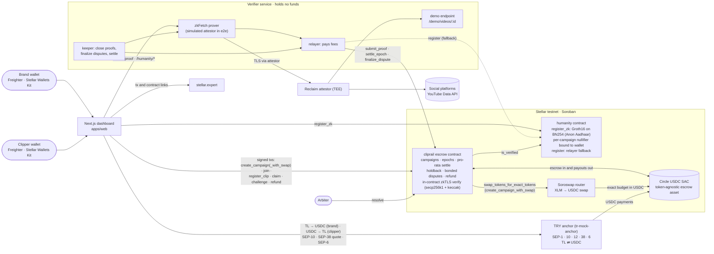
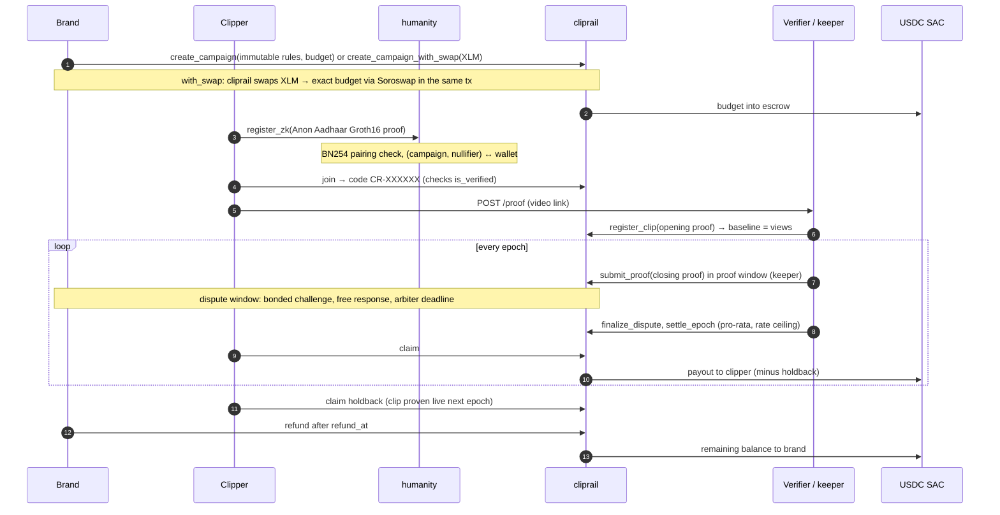

# ClipRail

**Verifiable pay-per-view clipping campaigns on Stellar.**

A brand locks a USDC budget in a Soroban escrow with rules that cannot change after launch. Clippers who are registered in a per-campaign humanity registry post campaign clips on their own social accounts, tagged with a personal campaign code. View counts are proven with zkTLS (Reclaim), and the proof is checked **inside the contract**: the attestor signature, the exact API URL, the extraction regexes, and the clipper's code in the video description. Each epoch the budget is split pro-rata over proven view growth, under a per-1k rate ceiling and per-human caps. Payout transactions cost well under a cent on testnet (measured below), so there is no minimum payout, and clippers in any country can be paid.

> **The number is real** (zkTLS, verified on-chain) · **One human, once** (per-campaign nullifier) · **The rules can't change** (Soroban escrow)

**Full lifecycle on testnet: 39/39 steps** (`pnpm --filter e2e run e2e` reproduces it and prints every explorer link).

What is and is not proven today:

- **In-contract proof verification** is tested against Reclaim's reference vector (`contracts/reclaim-verify`) and in a full testnet lifecycle run (create → join → clips → proofs → dispute → settle → claim → holdback → refund) using Reclaim-format proofs signed by a **simulated attestor**.
- **Live Reclaim zkFetch run:** pending credentials. **[TBD: link to live-proof testnet run]**
- **Humanity is verified on-chain.** `humanity.register_zk` checks an Anon Aadhaar Groth16 proof (BN254) inside Soroban, bound to the campaign (nullifier seed) and to the submitting wallet (signal hash), for ~30.8M CPU instructions (~0.034 XLM fee on testnet). The demo uses UIDAI **test** data signed with the Anon Aadhaar test key, proven server-side by the verifier; production pins the real UIDAI key and proves in the browser. A relayer `register` path remains as a fallback.
- **Funding and cash-out are live on testnet.** A brand can fund a campaign with XLM in one transaction (`create_campaign_with_swap` through the Soroswap router, tested: 47.37 XLM → 5 USDC escrow), and a clipper can cash out USDC to TRY through a SEP-6 anchor (tested: 5 USDC → 242.70 TL; 5000 TL → 101.98 USDC on the way in).

Status: hackathon build on Stellar **testnet**, Rise In × Stellar hackathon, **Scale track**. Live demo: **[LIVE_DEMO_URL]** · Demo video: **[TBD: demo video link]**

### Scale track requirements

- [x] **Integration (load-bearing): Soroswap.** `cliprail.create_campaign_with_swap` calls the Soroswap router from inside the contract, swaps the brand's XLM (or any asset with a pool) into exactly `budget` of Circle USDC and escrows it atomically. See [Stellar integrations](#stellar-integrations).
- [x] **Anchor / local currency: TRY via SEP-6.** SEP-1 discovery, SEP-10 auth, SEP-12 KYC, SEP-38 quotes and SEP-6 `deposit-exchange` / `withdraw-exchange` against the testnet anchor `tr-mock-anchor.fly.dev` (brand funds in TL, clipper cashes out to TL).
- [x] **Core feature:** verifiable pay-per-view escrow: in-contract zkTLS proof verification, on-chain Anon Aadhaar humanity (`register_zk`), pro-rata settle, holdback, bonded disputes, refund. [Full product lifecycle run](#full-product-lifecycle-run-testnet) on the demo deployment.
- [x] **Architecture diagram (Mermaid):** [Architecture](#architecture).
- [x] **SCF roadmap:** [Roadmap → SCF / InstAward](#roadmap--scf--instaward).
- [x] **Stellar skills cited:** [Stellar skills used](#stellar-skills-used).

**Jump to:** [How to evaluate](#how-to-evaluate) · [Architecture](#architecture) · [Stellar integrations](#stellar-integrations) · [Stellar skills used](#stellar-skills-used) · [Design decisions & trade-offs](#design-decisions--trade-offs) · [Challenges](#challenges) · [Honest limits](#honest-limits) · [Roadmap → SCF / InstAward](#roadmap--scf--instaward)

## How to evaluate

| What | Where |
|---|---|
| Live dashboard (Next.js) | **[LIVE_DEMO_URL]** |
| Verifier service (`/health`, `/demo/videos/:id`) | **[VERIFIER_URL]** |
| Contracts | [Demo deployment (testnet)](#demo-deployment-testnet), each linked to stellar.expert |
| Full lifecycle, reproducible | `pnpm --filter e2e run e2e`: 39/39 steps, prints every explorer link |
| Product lifecycle (Soroswap funding → ZK humanity → payouts → TRY cash-out) | `REFUND=1 pnpm --filter @cliprail/client smoke:full`, see [the run](#full-product-lifecycle-run-testnet) |

**Test wallets.** Use any wallet supported by Stellar Wallets Kit (e.g. Freighter switched to *Testnet*) and fund it with Friendbot. Campaign budgets use **Circle testnet USDC** (`USDC:GBBD47…LFLA5`, add a trustline). A brand without USDC can fund a campaign with XLM through Soroswap, or buy USDC with TL through the TRY anchor. No mainnet funds are involved.

**Five-minute check:**

```bash
(cd contracts && cargo test)                                 # cliprail, humanity (incl. Groth16), reclaim-verify
pnpm install && pnpm -r test                                 # verifier, @cliprail/shared, @cliprail/client
pnpm --filter e2e run deploy -- --redeploy                       # fresh e2e instance on testnet (simulated attestor)
pnpm --filter e2e run e2e                                    # full lifecycle on testnet, prints explorer links
pnpm --filter e2e run seed -- --mode local                       # demo seed; --mode real requires Reclaim credentials
```

A fresh e2e instance is needed per run because the video registry is global. Code worth reading: `contracts/reclaim-verify/src/lib.rs` (in-contract zkTLS), `contracts/humanity/src/groth16.rs` (BN254 Groth16), `contracts/cliprail/src/test/attacks.rs` (A1–A17).

---

## Three trust layers

| Layer | Guarantee | How |
|---|---|---|
| **The number is real** | The view count and description the platform served reach the contract unmodified | Reclaim zkTLS proof. Secp256k1 attestor signature, URL template, `responseMatches` and extracted `views`/`desc` are all verified in the `cliprail` contract (`contracts/reclaim-verify`), not by a backend |
| **One human, once** | A registered nullifier joins a campaign at most once, and caps apply per nullifier, not per account | `humanity` registry: `(campaign, nullifier)` and `(campaign, wallet)` are each unique. The nullifier is scoped per campaign and the proof is bound to the wallet. Anon Aadhaar Groth16 verified on-chain (`register_zk`); relayer `register` as fallback |
| **The rules can't change** | Rate, caps, windows, holdback, bond and arbiter are fixed at creation. There are no discretionary rejections | Budget sits in a Soroban escrow. Every payout is a formula over proven numbers. Disputes are bonded and time-boxed |

## The problem

Clipping is now a real market: brands and creators pay "clippers" per view to repost short cuts of their content. Whop Content Rewards has been reported to pay out on the order of tens of thousands of dollars per day (Forbes, April 2026, as cited by third-party guides). The market runs on trust it has not earned:

- **Discretionary payouts.** Platforms count views their own way and reject submissions "at our sole discretion". Clippers report long payout delays and agency cuts on top of platform fees.
- **Bot fraud.** Bot views are cheap. The StreamAlive founder described (blog post, September 2025) paying for a clipping campaign whose views turned out to be mostly bots. Nobody can prove what was counted.
- **Payout rails exclude the workforce.** Many clippers are in India, the Philippines and Latin America, where PayPal is unavailable or impractical.

Competitors advertise "verified views" but cannot show the verification. ClipRail makes it checkable: the count comes from a proof, the payout from immutable code.

## How it works

```
create ─▶ humanity ─▶ join (CR code) ─▶ register clip (opening proof = baseline)
      ─▶ [ epoch e: closing proof ─▶ bonded dispute ─▶ settle (pro-rata, rate ceiling) ─▶ claim ] × E
      ─▶ holdback released by next-epoch liveness ─▶ refund
```

1. **Create.** The brand calls `create_campaign` and the budget moves into escrow. Parameters are validated (`epoch_len ≥ proof + dispute + arbiter windows`, `claim_grace ≥ epoch_len`, `bond > 0`, arbiter ≠ brand) and are then immutable.
2. **Humanity.** The clipper submits an Anon Aadhaar Groth16 proof to `humanity.register_zk`. The contract recomputes the bound public inputs itself (UIDAI pubkey hash from config, `nullifierSeed = keccak256("cliprail:" ‖ campaign_id) >> 3`, `signalHash = keccak256(wallet ed25519 key) >> 3`), checks the QR timestamp against `max_age`, and runs the BN254 pairing check. A second wallet with the same nullifier is rejected.
3. **Join.** `join` checks `humanity.is_verified` and returns a code `CR-XXXXXX` derived from `sha256(campaign_id ‖ participant)`. The clipper puts it in the video description.
4. **Register clip.** The clipper submits the video link. The verifier produces an **opening proof**: the description contains the code, and the current views are N. The contract verifies it and records `baseline = N`, so only growth after registration counts. Each `(platform, video_id)` can be registered only once, globally.
5. **Closing proofs.** In every epoch's window `[content_end, proof_end)` anyone can submit a fresh proof. If the same clip is re-proven in the window, the higher view count wins. The verifier's keeper does this automatically.
6. **Bonded disputes.** Anyone can challenge a clip-epoch by posting a bond. The clipper responds for free. The arbiter rules on responded disputes only. An unanswered challenge excludes the clip. An arbiter who misses the deadline loses by default: the clipper wins. Excluded weight is redistributed to other clippers through the rate. It does not return to the brand.
7. **Settle.** After `settle_at(e)`, with no open disputes, `settle_epoch` fixes the epoch rate (see below). Unspent budget carries over to the next epoch.
8. **Claim.** `claim` pays each clip-epoch its share, O(1). Part of it (`holdback_bps`) is held back.
9. **Holdback.** Epoch e's held share is released only to clips that are still live, meaning they got a closing proof in epoch e+1. Deleted videos forfeit their share to the survivors. The last epoch has no holdback.
10. **Refund.** After `refund_at = settle_at(last) + claim_grace`, the remaining campaign balance returns to the brand.

## Architecture



Solid edges are live on testnet. The dashed edge is the relayer fallback for humanity.

### Campaign lifecycle



The verifier has **no authority over funds**. It cannot change a count because the attestor signs it, and it cannot pay anyone. The worst it can do is not submit a proof, and anyone else can submit one in the same window.

## Mechanism

Per epoch `e`, for clip `c` of participant `p`:

```
w_c   = min(max(views_c − baseline_c, 0), cap_views_clip) ;  w_c < min_views ⇒ 0
raw_p = Σ w_c                         (participant's clips this epoch)
w_p   = min(raw_p, cap_views_human)   (per-human cap)
W_e   = Σ w_p

B_e      = budget/E (+ remainder in last epoch) + carry_e
r_eff    = W_e == 0 ? 0 : min(r_max, 1000 · B_e / W_e)      (USDC per 1k views)
spent_e  = r_eff · W_e / 1000 ;   carry_{e+1} = B_e − spent_e

pay_c    = r_eff · w_p · w_c / (raw_p · 1000)
held_c   = pay_c · holdback_bps / 10000   (0 in the last epoch) ;  immediate_c = pay_c − held_c
```

- **High-water mark baseline.** A clip-epoch's baseline is pinned to the clip's `hwm` (the highest proven views so far) at the first closing proof. Views that drop and rise again are never paid twice.
- **No race.** With few views, clippers earn `r_max`. When demand exceeds the budget, the rate falls and everyone shares proportionally. `Σ payouts ≤ budget` always holds.
- **Holdback survivors share:**
  `held_total_e = spent_e · bps / 10000`, `held_survived_e = Σ held_i` over clips proven alive in e+1, and `holdback_claim_i = held_i · held_total_e / held_survived_e`.
- **Accounting invariant.** Every campaign has its own `balance` ledger, and every outflow is clamped to it. The contract's token balance equals `Σ campaign.balance + open bonds`.

## Security model

| Trusted party | What it could do | Mitigation |
|---|---|---|
| Reclaim attestor (single key today) | Sign a false count | Attestor allowlist in contract. Reclaim runs it in a TEE. Multi-attestor on the roadmap |
| Platform (YouTube) | Count bot views | Per-clip and per-human caps, `min_views`, bonded disputes, pro-rata dilution |
| Humanity relayer (fallback path) | Register fake nullifiers | The primary path `register_zk` needs no relayer: the Groth16 proof is verified on-chain and bound to the wallet. The relayer role is admin-set (`set_relayer`) and can be retired in production |
| Admin (UIDAI key config) | Accept proofs under a wrong key | `pubkey_hash` is pinned in `AadhaarConfig`. The demo uses the Anon Aadhaar test key (`test_key: true`); production pins the real UIDAI key |
| Brand | Challenge in bad faith | Bond goes to the clipper if the challenge fails. Excluded weight never returns to the brand |
| Arbiter | Rule with bias | Only rules on disputes the clipper answered. Missing the deadline means the clipper wins |
| Verifier / relayer | Withhold a proof (censor a clip) | Cannot touch funds or counts. Anyone can submit in the window, and the higher count wins |
| Admin | Change attestors, owners, platform config | Campaign rules are immutable. Production would use a timelock and multisig |

### Honest limits

- **zkTLS proves the count the platform displays, not that viewers are human.** We mitigate bot views with caps, disputes and pro-rata dilution. We do not claim to solve them.
- **One Reclaim attestor key.** The address we allowlist (`0x2448…9072`, from Reclaim's reference vector) is to be confirmed with a live proof. Trust moves from "our server" to "a third-party, signed, TEE-backed attestor". That is better, but not trustless.
- **Humanity uses UIDAI test data in the demo.** `register_zk` verifies a real Anon Aadhaar Groth16 proof on-chain, but the demo proof is generated by the verifier (`/humanity/aadhaar/prove`) from the official UIDAI test QR under the Anon Aadhaar **test** key. Production proves in the user's browser from their own Aadhaar QR and pins the real UIDAI key. Aadhaar covers India only until more identity sources are added. Identities can be rented, which raises the Sybil cost to the price of a real identity without eliminating it.
- **The TRY anchor is a testnet sandbox** (`tr-mock-anchor.fly.dev`): the SEP-6/10/12/38 flow is real, but the bank leg (TL in and out) is simulated and no real money moves. A licensed Turkish anchor is needed for production.
- **The live demo uses a platform endpoint we control** (`/demo/videos/:id`) so viewers can watch the count grow within minutes. Once Reclaim credentials are in place it is a **real zkTLS proof** verified in-contract; until then the testnet run uses a simulated attestor. The YouTube path uses the same verifier.
- The proof `timestampS` is chosen by the prover, so freshness relies on the allowlisted `owner` (our zkFetch app).

## Threat → mitigation

Every row has a dedicated test in [`contracts/cliprail/src/test/attacks.rs`](contracts/cliprail/src/test/attacks.rs) that asserts the exact error.

| # | Attack | Mitigation | Test |
|---|---|---|---|
| A1 | Replay the same proof | Replay set keyed by `keccak(identifier ‖ timestampS)` | `a01_proof_reuse` |
| A2 | Register one video in two campaigns (or `id=a,b` tricks) | Global `(platform, video_id)` registry and video-id charset check | `a02_video_twice` |
| A3 | Add a code to an already viral video | Baseline from the opening proof | `a03_code_added_to_viral_video` |
| A4 | Proof for another URL or video | URL template equality on root `url` | `a04_proof_for_other_video` |
| A5 | Proof with a different regex (e.g. likes) | Required `responseMatches` checked | `a05_other_regex` |
| A6 | Code missing, or someone else's code | Code search inside extracted `desc` only | `a06_code_missing_or_foreign` |
| A7 | Stale or future timestamp | Freshness and window checks | `a07_stale_or_future_timestamp` |
| A8 | Unauthorized attestor, owner, or tampered payload | Recovered-address allowlist and owner allowlist | `a08_unknown_attestor_or_owner` |
| A9 | Sybil: same person, second wallet | Per-campaign nullifier in `humanity` | `a09_sybil_second_wallet` |
| A10 | Many clips to exceed caps | Per-clip cap and per-human cap | `a10_caps_many_clips` |
| A11 | Budget exhaustion | Pro-rata rate and balance clamp | `a11_budget_exhaustion` |
| A12 | Views drop then rise again | High-water mark | `a12_views_drop_then_rise` |
| A13 | Double claim | `claimed` flag | `a13_double_claim` |
| A14 | Claim while disputed | Settle blocked by open disputes, and claim blocked by status | `a14_claim_while_disputed` |
| A15 | Non-arbiter resolves | `arbiter.require_auth()` | `a15_non_arbiter_resolve` |
| A16 | Early refund | `refund_at` | `a16_early_refund` |
| A17 | Video deleted after payout | No next-epoch proof, so its holdback goes to survivors | `a17_deleted_video_forfeits_holdback` |

## Demo deployment (testnet)

The canonical deployment used by the dashboard, the verifier and every run in this README:

| Component | ID / endpoint |
|---|---|
| `cliprail` | [`CBI6VFC5E2KFBRSDVCLMQVDOC7Q3AIO3EIMXTHSS2YXEUSY52EF2TQVZ`](https://stellar.expert/explorer/testnet/contract/CBI6VFC5E2KFBRSDVCLMQVDOC7Q3AIO3EIMXTHSS2YXEUSY52EF2TQVZ) |
| `humanity` (Anon Aadhaar `register_zk` configured) | [`CBXO7SKDQ22E7J7QAASIFLSJ7JAPX45YM3QA5KARY5OJHMFP3KTKP5MN`](https://stellar.expert/explorer/testnet/contract/CBXO7SKDQ22E7J7QAASIFLSJ7JAPX45YM3QA5KARY5OJHMFP3KTKP5MN) |
| USDC (Circle testnet USDC, SAC of `USDC:GBBD47IF6LWK7P7MDEVSCWR7DPUWV3NY3DTQEVFL4NAT4AQH3ZLLFLA5`) | [`CBIELTK6YBZJU5UP2WWQEUCYKLPU6AUNZ2BQ4WWFEIE3USCIHMXQDAMA`](https://stellar.expert/explorer/testnet/contract/CBIELTK6YBZJU5UP2WWQEUCYKLPU6AUNZ2BQ4WWFEIE3USCIHMXQDAMA) |
| Soroswap router (set via `set_router`) | [`CCJUD55AG6W5HAI5LRVNKAE5WDP5XGZBUDS5WNTIVDU7O264UZZE7BRD`](https://stellar.expert/explorer/testnet/contract/CCJUD55AG6W5HAI5LRVNKAE5WDP5XGZBUDS5WNTIVDU7O264UZZE7BRD) |
| TRY anchor | [`tr-mock-anchor.fly.dev`](https://tr-mock-anchor.fly.dev/.well-known/stellar.toml): SEP-1 / SEP-6 / SEP-10 / SEP-12 / SEP-38 (testnet sandbox, no real money) |
| zkTLS attestor | **simulated** (Reclaim-format signatures from a clearly labeled test key allowlisted only on this instance); to be switched to live Reclaim |

Network: `Test SDF Network ; September 2015`, RPC `https://soroban-testnet.stellar.org`. Verifier URL: **[VERIFIER_URL]**

<details>
<summary>Legacy deployment (pre-ZK, own test USDC)</summary>

Earlier instance with relayer-only humanity and a self-issued test USDC; kept for reference, not used by the demo.

| Contract | ID |
|---|---|
| `cliprail` | [`CCICEPQCY25RNF5SAJ3FPUXPXEIRQ3GOUMSVZGVCHRJ6L6Q3FHJL3TST`](https://stellar.expert/explorer/testnet/contract/CCICEPQCY25RNF5SAJ3FPUXPXEIRQ3GOUMSVZGVCHRJ6L6Q3FHJL3TST) |
| `humanity` | [`CAUU4KCBSL3L5CCLU2S5GNZ354S4X3DP6Z5ZSWMSDDCNNNE3AJSCGKMQ`](https://stellar.expert/explorer/testnet/contract/CAUU4KCBSL3L5CCLU2S5GNZ354S4X3DP6Z5ZSWMSDDCNNNE3AJSCGKMQ) |
| USDC (own test issuer, SAC) | [`CCRCO347GR4FVCZACMTXZWE4EKTICARZXRRTS4R4HZZYK7R7E65UX45E`](https://stellar.expert/explorer/testnet/contract/CCRCO347GR4FVCZACMTXZWE4EKTICARZXRRTS4R4HZZYK7R7E65UX45E) |

</details>

## Full product lifecycle run (testnet)

`REFUND=1 pnpm --filter @cliprail/client smoke:full` drives the real product path with `@cliprail/client` (`createApi("chain")` + `createTryRamp("chain")`, the same code the dashboard uses) against the [demo deployment](#demo-deployment-testnet), with keypair signers for brand, two clippers and the arbiter. Run of 2026-09-20: **30/30 steps PASS**, ~8 minutes (2 epochs of 120 s). Attestor: simulated; humanity: Anon Aadhaar TEST proofs, proven by the verifier.

| Step | Action | Result | Tx |
|---|---|---|---|
| 1 | Brand funds campaign #4 with XLM via Soroswap (`create_campaign_with_swap`, require_humanity) | 47.37 XLM → 5.0000000 USDC escrowed (Circle USDC) | [49dfd8c5…](https://stellar.expert/explorer/testnet/tx/49dfd8c54fd47c572e61c84000a6f1e0937d3db010929c869ef89fafab8f61d8) |
| 2 | clipper1 `register_zk` (Anon Aadhaar, fresh identity) → `is_verified` | verified | [1d21c283…](https://stellar.expert/explorer/testnet/tx/1d21c283f48831a03017344bbd617c6d36d80e8267c5c6a92f001544f65145ea) |
| 2 | clipper1 `join` | code CR-694479 | [d3fed1b0…](https://stellar.expert/explorer/testnet/tx/d3fed1b0d6e3a3e93c6cbc2f0f1107b742f2d0757172c2debd2fb14df4d61d73) |
| 2 | clipper2 `register_zk` → `is_verified` | verified | [c97b285d…](https://stellar.expert/explorer/testnet/tx/c97b285d9a98eb1893840643890275fa4eada5e2d25948a7bb11ec2bb52a2be0) |
| 2 | clipper2 `join` | code CR-YN0D2A | [2b2edd22…](https://stellar.expert/explorer/testnet/tx/2b2edd226a67930353088bea6e623a1b2b24f8cd61d5813d24ac42f2f4ec0160) |
| 3 | clipper1 `register_clip` (opening proof, code in description) | baseline 100 views | [8c51b35a…](https://stellar.expert/explorer/testnet/tx/8c51b35ab2fc2141b0541c0df141e2efc1a1067dc6f750736a2767c6565fc9ba) |
| 3 | clipper2 `register_clip` | baseline 100 views | [d3d55bb3…](https://stellar.expert/explorer/testnet/tx/d3d55bb36b93b4f4ba8eff68e979907fd8f3d7b3e7b3b02046c5194f9a9b6d3e) |
| 3 | Keeper: closing proofs e0 + `settle_epoch` e0 | weights 4000 / 2000; spent 2.4999996 USDC, held 0.4999999 | — |
| 3 | clipper1 / clipper2 `claim` e0 | 1.3333331 / 0.6666665 USDC | [a123688b…](https://stellar.expert/explorer/testnet/tx/a123688beb3f242fcffcfe77d0ed116d6a7844b4883414f71487fcf8cb49e360) · [8dc1d336…](https://stellar.expert/explorer/testnet/tx/8dc1d336dafbb266695f84361ee8a4bc1e249f48616b59c3d8e6c55425da4832) |
| 3 | Keeper: closing proofs e1 (liveness for e0 holdback) | weights 1000 / 500 | — |
| 3 | clipper1 / clipper2 `claim_holdback` e0 | 0.3333332 / 0.1666666 USDC | [3f559212…](https://stellar.expert/explorer/testnet/tx/3f5592120c44867bab7b969a7dfdc614b59377ba189288e06d21d0e13e8ae23a) · [5c9a0fd1…](https://stellar.expert/explorer/testnet/tx/5c9a0fd17eaaea980d5cd8696d1b57de020615f368b5c669b58985678ed84216) |
| 3 | Keeper `settle_epoch` e1; clipper1 / clipper2 `claim` e1 | 1.0000000 / 0.5000000 USDC | [c857a66a…](https://stellar.expert/explorer/testnet/tx/c857a66ac0aa5aefa889165be8118f6d0582d06113905a5aa99217abd287d88d) · [e49d5f14…](https://stellar.expert/explorer/testnet/tx/e49d5f14c56e4c05bea4f989ccccef4477f654029764055e7b7bb485c0cbf168) |
| 4 | clipper1 cashes out all earnings to TRY (SEP-10 → SEP-12 → SEP-38 quote → SEP-6 `withdraw-exchange` → USDC payment) | 2.6666663 USDC → 129.44 TL (48.54 TL/USDC), status `completed`, bank ref FAST-W68GO36XTZ | [b252098a…](https://stellar.expert/explorer/testnet/tx/b252098a198be9555fc08bdf1dc17679701b86223fd2349734c26028849b38c7) |
| 5 | Brand `refund` after `refund_at` | 1.0000006 USDC unspent budget back to brand | [16847542…](https://stellar.expert/explorer/testnet/tx/1684754223d5e8e5b4351ff3789f832e4872e58ab406403d26d227c795a6b867) |

Totals: clipper1 earned 2.6666663 USDC, clipper2 1.3333331 USDC (2:1, matching their proven view growth); 5 USDC in = 3.9999994 paid out + 1.0000006 refunded (7-decimal rounding dust stays with the brand). The TL payout on the anchor side is simulated (testnet sandbox).

## Repository layout

```
contracts/
  reclaim-verify/   no_std lib: identifier, EIP-191 digest, secp256k1 recover, root-level JSON scanner
  cliprail/         campaigns, global video registry, epochs, pro-rata settle, claims, holdback, disputes, refund
  humanity/         per-campaign nullifier registry: register_zk (on-chain Anon Aadhaar Groth16, BN254), register (relayer fallback)
services/verifier/  Node/TS: zkFetch proofs, relay, keeper, demo platform endpoint, Anon Aadhaar demo prover, rate limits
packages/
  client/           @cliprail/client: chain and mock CliprailApi for the web app (tx helpers with retry, proof calls)
  cliprail-client/  generated TS bindings (stellar contract bindings typescript)
  humanity-client/  generated TS bindings
  shared/           @cliprail/shared: timeline, payout, errors, video-id parsing, formatting (mirrors the contract)
apps/web/           Next.js dashboard (brand, clipper, arbiter views; Stellar Wallets Kit)
config/             providers.json (URL templates + regexes per platform)
fixtures/           Reclaim reference vector, required substrings
scripts/            setup-accounts.sh, deploy.sh, bindings.sh
  e2e/              testnet lifecycle run (deploy.ts, run.ts), simulated attestor (proofgen.ts), demo seeding (seed-demo.ts)
```

## Running it

**Prerequisites:** Rust stable with `wasm32v1-none`, `stellar-cli` v28, Node 24, pnpm.

```bash
rustup default stable && rustup target add wasm32v1-none
brew install stellar-cli
pnpm install
```

**Contracts: test and build**

```bash
cd contracts && cargo test && stellar contract build
```

**Testnet: accounts, deploy, bindings**

```bash
bash scripts/setup-accounts.sh          # funds admin/relayer/arbiter/brand/clippers, issues test USDC + SAC (idempotent)
RECLAIM_APP_ID=0x… DEMO_PUBLIC_BASE=https://verifier.example.com \
  bash scripts/deploy.sh                # deploys humanity + cliprail (constructors) and sets attestors/owners/platforms
bash scripts/bindings.sh                # regenerates packages/cliprail-client and packages/humanity-client
```

`deploy.sh` reuses the IDs in `scripts/.accounts/deploy.env` and only replays the config calls. Use `FORCE_DEPLOY=1` to deploy fresh contracts.

**Verifier service**

```bash
cp services/verifier/.env.example services/verifier/.env   # RECLAIM_APP_ID/SECRET, YT_API_KEY, DEMO_PUBLIC_BASE, ...
pnpm --filter verifier dev                                 # http://localhost:8787
```

- Without Reclaim credentials the service still starts. `/health` and `/demo/*` work, and `/proof` returns 503.
- `RELAYER_SECRET`, `CLIPRAIL_ID` and `HUMANITY_ID` fall back to `scripts/.accounts/`.
- `KEEPER=1` enables automatic closing proofs, dispute finalization and settlement.
- `DEMO_MODE=1` enables `/humanity/demo-register`.
- `WRITE_TOKEN` protects write endpoints, and `/proof` is rate-limited per IP.
- Docker and Caddy deployment instructions are in [services/verifier/README.md](services/verifier/README.md).

**Web:** `pnpm --filter web dev` (http://localhost:3100).

## Tests

| Suite | Command | Result |
|---|---|---|
| `cliprail` contract (flows, disputes, A1–A17 attacks, Soroswap funding) | `cd contracts && cargo test` | 48 passed |
| `humanity` contract (registry, Groth16 / Anon Aadhaar, field aliasing, wallet and campaign binding) | ″ | 36 passed |
| `reclaim-verify` (Reclaim reference vector, k256 signatures, JSON scanner) | ″ | 24 passed |
| Verifier service | `pnpm --filter verifier test` | 89 passed (1 skipped) |
| `@cliprail/shared` (timeline/payout parity with contract) | `pnpm --filter @cliprail/shared test` | 72 passed |
| `@cliprail/client` (chain/mock API, Soroswap quote, SEP-6/10/12/38 ramp) | `pnpm --filter @cliprail/client test` | 66 passed |
| Testnet lifecycle (simulated attestor) | `pnpm --filter e2e run e2e` | 39/39 steps |

**335 unit and integration tests in total**, plus the 39-step testnet run and the product lifecycle run below. Tests never call the real zkFetch.

## Cost

Measured on testnet in the lifecycle run: average CPU instructions from simulation and the fee actually paid.

| Function | CPU instructions | Fee paid |
|---|---|---|
| `create_campaign` | ~1.45M | ~0.111 XLM |
| `join` | ~1.7M | ~0.023 XLM |
| `register_clip` (opening proof, verified in contract) | ~5.2M | ~0.061 XLM |
| `submit_proof` (closing proof, verified in contract) | ~5.3M | ~0.072 XLM |
| `challenge` | ~2.3M | ~0.059 XLM |
| `settle_epoch` | ~1.5M | ~0.0012 XLM |
| `claim` | ~2.0M | ~0.0023 XLM |
| `humanity.register_zk` (Groth16, 9 public inputs) | ~30.8M | ~0.034 XLM |

Reclaim proof verification alone costs 3.2M instructions (142 B context) to 10.2M (7.9 KB), measured on the real wasm including VM setup. Every call stays far inside Soroban's 400M-instruction per-transaction budget. The most expensive call is `create_campaign` at ~0.11 XLM; the recurring payout calls (`settle_epoch`, `claim`) cost a small fraction of a cent.

## Why Stellar

- **Native USDC and low fees.** A classic USDC payment costs ~0.00001 XLM, and the Soroban calls above cost cents or less (`claim` ~0.0023 XLM), which makes per-epoch micro-payouts with no minimum threshold possible.
- **Anchors and MoneyGram** let clippers cash out locally (SEP-6 / SEP-24) in markets PayPal does not serve; ClipRail's TRY cash-out already runs over SEP-6 on testnet.
- **Soroban DeFi composability:** the escrow calls the Soroswap router directly, so a brand can fund in XLM and the contract still escrows exact USDC.
- **Host crypto functions** (`secp256k1_recover`, `keccak256`) make it cheap enough to verify a Reclaim zkTLS proof fully inside a Soroban contract: a full verification measures ~3–10M instructions of the 400M per-transaction budget. BN254 pairing and MSM host functions make on-chain Groth16 identity proofs practical: Anon Aadhaar verifies in ~30.8M instructions.
- A layer that complements the **Stellar Disbursement Platform**: SDP distributes, ClipRail proves what should be paid.

## Stellar integrations

Each integration below carries weight in the protocol; none is decorative.

| Integration | Status | What it does in ClipRail |
|---|---|---|
| **Stellar Wallets Kit** (`@creit.tech/stellar-wallets-kit`) | Live | Wallet connection and transaction signing in the dashboard (Freighter and other kit wallets) for brands, clippers and arbiters. Every state change that moves money is signed by the user's own wallet |
| **Circle USDC via the Stellar Asset Contract** | Live (Circle testnet USDC SAC) | The escrow asset. `create_campaign`, `claim`, bonds and `refund` are SEP-41 `transfer` calls on the SAC. The contract is token-agnostic: it takes the token address per campaign, so an anchor-issued TRY token works the same way |
| **Soroswap** (router) | Live, contract-level | `create_campaign_with_swap`: the `cliprail` contract calls the Soroswap router (`swap_tokens_for_exact_tokens`) and escrows exactly `budget` USDC in the same brand-signed transaction, with a slippage cap and deadline; the client quotes via `router_get_amounts_in`. Tested on testnet: 47.37 XLM → 5 USDC escrow |
| **Soroban host crypto: secp256k1 + keccak256** | Live | Recover the Reclaim attestor address and hash the claim identifier, so a zkTLS proof is verified fully in-contract (~3–10M instructions) |
| **Soroban host crypto: BN254 pairing + G1 MSM** | Live | Groth16 verification of Anon Aadhaar proofs in `humanity.register_zk` (~30.8M CPU instructions, ~0.034 XLM fee on testnet) |
| **Reclaim Protocol zkTLS** (zkFetch, attestor) | Integrated; live-credential run pending | Produces signed proofs of the view count and description the platform served. Tests and the e2e run use a simulated attestor that signs in the exact Reclaim format |
| **Anon Aadhaar circuits (PSE)** v2 | Live (`register_zk` on-chain verify); demo uses UIDAI test data, proven server-side | Proof of a unique Aadhaar holder with a per-campaign nullifier, bound to the Stellar wallet via the signal hash |
| **TRY anchor: SEP-1 + SEP-10 + SEP-12 + SEP-38 + SEP-6** (`tr-mock-anchor.fly.dev`) | Live via SEP-6 (testnet sandbox) | Brand buys USDC with TL (`deposit-exchange`), clipper cashes out USDC to TL (`withdraw-exchange`) with a firm SEP-38 quote. Tested: 5000 TL → 101.98 USDC; 5 USDC → 242.70 TL. The escrow needs no change for this |
| **Stellar RPC + stellar.expert** | Live | The dashboard, keeper and e2e scripts read contract state and simulate/submit transactions via Stellar RPC; every transaction and contract is linked on stellar.expert |

## Stellar skills used

We built with the Stellar developer skills from [github.com/stellar/stellar-dev-skill](https://github.com/stellar/stellar-dev-skill):

| Skill file | Used for |
|---|---|
| `skills/smart-contracts/SKILL.md` | Soroban project setup, contract anatomy, build and deploy workflow (`cliprail`, `humanity`, `reclaim-verify`) |
| `skills/smart-contracts/development.md` | Storage and TTL, authorization, SAC token calls, events, errors |
| `skills/smart-contracts/testing.md` | Unit and attack tests (A1–A17), cost measurement |
| `skills/smart-contracts/security.md` | Checklist for escrow accounting, auth, replay and time windows |
| `skills/zk-proofs/SKILL.md` | Groth16 verification with the BN254 host functions, public-input canonicality |
| `skills/dapp/SKILL.md` | Stellar Wallets Kit and Freighter integration, transaction building, simulation and signing in Next.js |
| `skills/assets/SKILL.md` | Circle testnet USDC trustlines, SAC interop, test-asset issuance |
| `skills/data/SKILL.md` | Stellar RPC reads, events, explorer links |
| `skills/standards/SKILL.md` | SEP-1 / SEP-10 / SEP-12 / SEP-38 / SEP-6 anchor flow for the TRY on/off-ramp, SEP-41 token interface; Soroswap in the DeFi ecosystem reference |

## Design decisions & trade-offs

- **Verify zkTLS in the contract, not in a backend.** The verifier service can only deliver proofs; it cannot change a count or move funds. Cost: ~5M instructions per proof, which Soroban's budget absorbs easily.
- **Minimal parsing instead of a JSON library.** Soroban contracts have no JSON parser, so `reclaim-verify` rebuilds the canonical claim identifier from bytes and uses a small scanner that only reads the root-level `url`, `responseMatches` and `extractedParameters`. Smaller wasm and a narrow attack surface, at the price of depending on Reclaim's exact serialization (pinned by fixtures).
- **Pro-rata with a rate ceiling, not first-come-first-served.** No race to claim; `Σ payouts ≤ budget` always holds; unused budget carries over.
- **Holdback tied to next-epoch liveness.** Discourages post-payout deletion without an extra "prove alive" transaction: the next closing proof doubles as liveness evidence.
- **Bonded, time-boxed disputes with a default in the clipper's favor.** The arbiter can only rule on answered disputes, and a missed deadline cannot be used to stall payouts.
- **Per-campaign nullifiers.** A person's identity cannot be linked across campaigns, and a nullifier is spent only within one campaign.
- **Token-agnostic escrow.** The token is a campaign parameter, so USDC today and anchor-issued local stablecoins later need no contract change.
- **Relayer kept as a fallback for humanity.** It keeps the demo usable if a device cannot generate a proof, while the trustless `register_zk` path is primary.

## Challenges

- **zkTLS in a contract with no JSON parser.** Reproducing Reclaim's identifier and signature digest byte-for-byte (JCS-style canonical JSON, EIP-191) took reference vectors and fixtures.
- **Nested-key spoofing.** A plain substring search can be fooled by a nested `"url"` or `extractedParameters` (e.g. inside headers or parameter values). After review we replaced it with a top-level-only JSON scanner that ignores nested keys and rejects duplicate top-level keys, with dedicated tests.
- **ZK public-input aliasing mod r.** BN254 reduces scalars modulo r, so `s` and `s + k·r` verify identically. `humanity` rejects any non-canonical input (`InputNotInField`) and recomputes the nullifier seed and wallet-bound signal hash itself instead of trusting the client.
- **Keeper timing vs ledger close.** Windows are defined in ledger time, which advances in ~5 s steps. The keeper schedules closing proofs, dispute finalization and settlement against ledger timestamps with a margin, not wall-clock time, to avoid off-by-one-window failures.
- **Being honest about the attestor.** Until live Reclaim credentials are in place, the e2e run uses a simulated attestor. It signs in the exact Reclaim format with a separate, clearly labeled test key that is allowlisted only on the e2e instance.
- **Keeping off-chain math identical to the contract.** `@cliprail/shared` mirrors the timeline and payout formulas and is tested for parity, so the dashboard shows exactly what the contract will pay.

## Roadmap → SCF / InstAward

| Milestone | Timeline | Deliverables |
|---|---|---|
| **M1: Production-ready testnet** | 2–4 weeks | Live Reclaim zkFetch proofs in the default flow (multi-proof run on testnet); TRY cash-out moved from the testnet sandbox anchor to a licensed Turkish anchor (SEP-6/SEP-24); verifier and keeper hosted on Hetzner behind HTTPS with monitoring; in-browser Anon Aadhaar proving; external security review of `cliprail`, `humanity` and `reclaim-verify` |
| **M2: Mainnet pilot** | +1–2 months | Mainnet deployment with real UIDAI key pinned; pilot campaigns with 2–3 brands (crypto projects, music labels); passkey smart accounts and fee sponsorship so clippers need no seed phrase or XLM; device-side zkTLS for TikTok, X and Instagram; admin timelock and multisig |
| **M3: SCF Build Award** | +3 months | SCF Build application backed by pilot metrics; Self / zkPassport identity alongside Aadhaar; SDK and dashboard for agencies running many campaigns; multi-attestor threshold verification; Stellar Disbursement Platform integration for large payouts |

**Success metrics** (reported publicly from on-chain data): campaigns launched, USDC escrowed and paid out, clips verified, unique verified humans, dispute rate and outcome split, median time from epoch end to payout, share of clippers cashing out through an anchor.

**Funding ask.** We plan to apply for an SCF InstAward to finish M1, then an SCF Build Award (up to $150k) paid in tranches against M1–M3, with each tranche tied to the deliverables and metrics above.
